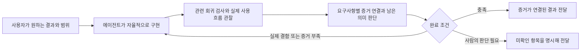

# 최근 실행으로 본 검증 비용과 에이전트 자율성

조사일: 2026-09-08.
조사 기준 소스: `0453cc134cf23ff140972c6dfb8d7f978181cc77`.
이 문서는 실행 기록을 읽고 작성한 검토안이며, 하네스 동작이나 실행 중인 run을 변경하지 않았다.

## 판단

Sasu가 보장할 것은 사용자가 요구한 결과, 변경 권한, 완료 증거의 정직성이다.
구현 순서, 작업 분할, 도구 선택, 세부 검사 방법은 에이전트가 판단할 공간을 더 넓혀도 된다.
이를 위해 먼저 **요구사항을 기록하는 단위와 증거를 얻기 위해 실행하는 단위를 분리**하는 편이 좋다.

AC가 30개라는 것은 확인할 약속이 30개라는 뜻이다.
별도 테스트 파일 30개, 프로세스 30개, 독립 판정 모델 30개가 필요하다는 뜻은 아니다.
하나의 실제 사용자 흐름에서 여러 약속을 관찰하고, 각 약속이 어느 관찰로 충족됐는지를 남길 수 있다.
반대로 AC 수를 줄이려고 서로 다른 요구사항을 한 문장에 숨기는 것은 개선이 아니다.

지금 줄일 대상은 모든 테스트가 아니라 중복 실행, 검사를 위한 별도 구현, 동일한 사실의 반복 판정, 하네스 복구를 위한 수작업이다.
실제 사용 중 드러난 결함, 권한과 데이터 경계, 구현 누락을 잡는 검증은 유지할 가치가 있다.

## 조사 범위와 해석 한계

기간은 한국 시각 2026-09-01 00:00부터 2026-09-08 오전 조사 시점까지다.
첫 관찰 시각은 08:26:25이며, 작업 중인 기록은 이후 읽은 스냅샷의 시각과 구분한다.
로컬 프로젝트의 `agents/runs`, 구형 `agents/implement`, PRD와 보존된 세션 기록을 읽었다.
실행 명령이나 앱을 새로 돌리지 않았다.

완료되지 않은 run을 제품 실패로 세지 않는다.
중단, 이관, 다른 작업으로 대체, 증거 미등록, 실행 환경 오류도 완료되지 않은 상태를 만든다.
파일 수정 시각만으로 해당 기간에 제품 구현이나 검증이 실행됐다고 판단하지 않는다.
기간 안에 행정적으로 retired 처리된 오래된 run과, 실제 검사 이벤트가 발생한 run을 구분한다.

총 경과 시간에는 사람의 부재와 다른 작업 시간이 섞인다.
검사별 `durationMs` 합계에는 병렬 실행과 통합 검증 내부의 중첩이 섞인다.
따라서 이 조사에서는 그것을 구현 시간과 나누어 검증 비율이라고 부르지 않는다.
현재 벤치마크 보고기의 fallback 역시 실행 시간 합을 총 경과 시간에서 차감하므로, `unattributedSeconds`는 구현 시간이 아니다.
근거: [`benchmark_report.js`](../../skills/benchmark-implement/scripts/benchmark_report.js#L550).

<!-- CASE_FINDINGS -->

## 자율성과 완료 규칙의 경계

에이전트가 자율적으로 결정할 항목과 하네스가 고정할 항목은 다음과 같다.

| 에이전트가 결정 | 하네스가 고정 |
| --- | --- |
| 구현 순서와 내부 작업 분할 | 사용자가 승인한 결과와 범위 |
| 코드 구조와 사용 도구 | 실행 권한과 변경 소유 경계 |
| 어떤 흐름으로 여러 요구사항을 확인할지 | 각 요구사항에 실제 증거 또는 명시적인 미확인 상태가 있음 |
| 기존 테스트 재사용과 필요한 새 테스트 | 실행 실패를 성공으로 기록하지 않음 |
| 증거의 의미와 추가 관찰 필요성 | 어떤 소스와 환경에서 얻은 결과인지 기록 |
| 확인된 결함을 고치는 방법 | 사람의 판단을 에이전트의 승인으로 대체하지 않음 |

매번 같은 명령 순서로 작업하도록 만드는 것과 결과를 믿을 수 있게 만드는 것은 다르다.
모델 판정은 많은 규칙으로 감싸도 확률적 판단이다.
결정적으로 만들 수 있는 것은 기록의 무결성, 권한, 검사 실행 결과의 취급, 미확인 항목을 PASS로 바꾸지 않는 완료 조건이다.
제품 의미의 판단에는 모델과 사람의 역할이 남는다.

화살표는 필요한 데이터 의존성을 나타낸다.
독립적인 검사와 관찰은 병렬로 실행할 수 있다.
수정 시에는 영향을 받은 증거의 유효성을 다시 판단하며, 위 그림을 모든 단계를 무조건 처음부터 반복하는 명령 순서로 구현하면 안 된다.

## 먼저 줄일 것

### 1. 하나의 관찰을 여러 행이 공유하게 한다

같은 앱 상태, 같은 fixture, 같은 사용자 흐름을 보는 행은 관찰을 공유한다.
각 행의 관찰 지점과 실패 원인은 유지한다.
예를 들어 생성, 편집, 저장, 다시 열기를 한 번 수행하면서 각각의 기대 결과를 확인할 수 있다.
단순히 “이 흐름이 여러 AC를 커버한다”는 선언이나 프로세스의 exit 0만으로 개별 행의 의미까지 증명했다고 보지는 않는다.

이미 있는 테스트 결과와 실행 증거를 먼저 사용한다.
결과를 연결하려고 별도 자기보고용 PASS JSON 스크립트를 만드는 것은 피한다.
일회성 UI 확인은 실제 화면과 동작 증거로 끝낼 수 있으며, 모든 문구와 배치에 영구 테스트 파일을 추가할 필요는 없다.

### 2. 마지막 검증을 한 번의 관찰 묶음으로 구성한다

개발 중 필요한 테스트는 에이전트가 수시로 실행한다.
마지막에는 현재 결과물에 필요한 기존 회귀 검사, 실제 사용자 흐름, 남은 의미 판단을 한 번 구성한다.
같은 결과를 행별 검사, 전체 검사, 별도 판정에서 다시 얻고 있다면 중복을 제거한다.
전체 회귀 검사가 잡는 실패와 개별 행 검사가 잡는 실패가 다르면 둘 다 유지한다.

이 제안은 “종료 직전에는 무조건 한 번만 검사한다”는 새 횟수 제한이 아니다.
실패와 수정이 있으면 재검증이 필요하다.
수정 이유, 영향을 받은 범위, 다시 확인해야 할 사실이 다음 실행을 결정하게 한다.

### 3. 증거 부족과 실행 환경 오류를 제품 결함에서 분리한다

명령 연결이 없거나 증거 파일이 접근 불가능한 상태는 제품 로직을 수정하라는 신호가 아니다.
잘못된 호출 계약은 실행 전에 알려주고, 실행 환경 문제는 그 경계에서 해결하게 한다.
복구 후 제품에 변화가 없었다면, 유효한 다른 관찰까지 폐기해야 하는지 따져야 한다.
실행되지 않은 항목을 PASS로 만드는 예외는 추가하지 않는다.

### 4. 독립 검토는 남은 실패 가능성에 집중시킨다

실행 증거만으로 닫히지 않는 요구사항 누락, 중요한 위험, 실제 UX 품질에는 독립적인 검토가 도움이 된다.
이미 관찰한 사실을 행마다 다시 설명하고 평가하는 호출은 줄일 후보이다.
여러 행을 묶더라도 한 판정에 무관한 전체 변경을 몰아넣지 말고, 공통 맥락과 증거가 있는 범위로 나눈다.

새 검토가 매번 새 권고를 만들고, 그 권고를 반영할 때마다 전체 검토를 새로 시작하는 구조는 끝이 없다.
기존 finding과 수정 내용을 이어 보고, 필수 요구사항 위반과 선택적 개선을 구분해야 한다.
알려진 중요한 결함은 횟수 제한 때문에 PASS 처리하면 안 된다.
수렴하지 않는 항목은 미해결로 남겨 사람이 판단할 수 있어야 한다.

### 5. 전체 소스 해시만 보고 재사용하지 않는다

첫 개선은 같은 관찰을 여러 행이 사용하는 것으로 제한하는 편이 단순하고 안전하다.
다른 시점의 증거 재사용은 더 어려운 문제다.
소스가 같아도 DB, 외부 서비스, ignored 파일, 설치된 앱 번들, 환경이 달라질 수 있다.
파일 경로가 겹치지 않는다는 이유만으로 영향이 없다고 판단할 수도 없다.
현재 관찰에 영향을 주는 입력을 충분히 설명할 수 있을 때에만 재사용하고, 불명확하면 해당 관찰을 다시 수행한다.

## PRD에서 바꿀 관점

PRD는 사용자가 원하는 결과와 의미 있는 예외를 표현해야 한다.
변수, 헬퍼 함수, 작업 순서, 내부 위임 여부를 행으로 늘리는 방향은 피한다.
어떤 구현을 선택해도 지켜야 하는 결과가 좋은 Behaviors 행이다.

행마다 검사 방법이 있는 최신 형식은 활용하되, 행마다 새로운 검사 프로그램을 작성하라는 뜻으로 읽지 않아야 한다.
검사 방법은 기존 증거 또는 같은 흐름에서 얻을 관찰을 가리킬 수 있어야 한다.
검증이 어렵다는 이유만으로 핵심 요구사항을 삭제하거나 `human`으로 보내지는 않는다.

| 요구사항 종류 | 적절한 증거의 기본 방향 |
| --- | --- |
| 계산, 자격, 상태 전이, 권한, 데이터 손실 | 기대값이 제품 규칙에서 나온 경계 검사 |
| 저장, 복구, 외부 시스템 연동 | 실제 결과 상태를 확인하는 통합 경로 |
| 버튼, 목록, 입력, 화면 전환 | 하나의 사용자 흐름에서 여러 결과를 관찰 |
| 문구, 여백, 단순 표시 | 해당 화면에서 직접 확인하며 필요 없는 영구 테스트는 추가하지 않음 |
| 선호, 디자인 방향, 제품 해석 | 명시된 기준과 사람이 판단할 부분을 구분 |

이는 사용자에게 새 위험 등급, 검증 개수, 실행 모드를 설정하게 하자는 제안이 아니다.
기존 요구사항을 읽고 적합한 증거를 고르는 책임을 에이전트와 하네스 내부에 둔다는 뜻이다.

## 원칙과의 관계

저장소 원칙 1과 2는 함께 적용한다.
모든 요구사항의 충족 여부를 추적하면서, 중복 관찰과 장부 작업은 줄인다.
다만 원칙 1의 “가능한 가장 강한 도구를 끝까지 찾는다”는 문구는 적정한 관찰 이후에도 검증을 계속 늘릴 유인이 있다.
**“요구한 사실을 충분히 구별할 수 있는 증거를 얻고, 추가 검사가 잡을 별개의 실패가 없으면 멈춘다”**는 방향으로 문구를 바꾸는 것을 제안한다.
이는 현재 규칙의 해석만으로 이미 허용된다고 주장하는 것이 아니라, 규칙 수정 제안이다.

원칙 6은 의미 단위를 강조하지만, 설명에서 판정 단위를 AC 하나로 고정한다.
이를 **“판정 결과는 요구사항별로 남기고, 실행과 모델 호출은 공통 의미와 증거가 있는 요구사항을 묶는다”**로 분리하는 편이 좋다.
원칙 4에 따라 새 묶음 개념을 넣는다면 개별 행마다 중복된 실행과 재판정 경로를 함께 없애야 한다.
원칙 5에 따라 입력의 순수성이 확인되지 않은 검사는 해시가 같다는 이유로 생략하지 않는다.
원칙 13에 따라 생성적 리뷰의 재시작에는 수렴 경계를 둔다.

공통 엔지니어링 원칙 2와 7에 따라 기존 실행기와 증거 구조를 확장하고, 별도 경량 하네스나 설정 계층을 만들지 않는다.
엔지니어링 원칙 12에 따라 테스트의 개수보다 잡을 수 있는 실제 결함과 유지 비용을 판단한다.
코드 기반 자동 판정과 의미 판단을 구분하는 것은 저장소 원칙 7도 따른다.

## 모델이 바뀔 때 확인할 것

모델이 좋아졌다는 이유만으로 모든 검토를 없애거나, 기존 단계를 영구히 유지하지 않는다.
새 모델에서 가치가 줄어든 단계를 실제 작업으로 확인하고 하나씩 제거한다.
가벼운 UI 수정, 상태가 있는 작은 앱, 권한이나 데이터가 중요한 변경처럼 성격이 다른 사례를 비교하면 충분한 출발점이 된다.

먼저 현재 방식과 관찰 공유 방식의 차이 하나만 비교한다.
동일 요구사항과 시작 상태, 모델 설정, 실행 환경을 기록하고, 결과의 누락과 실제 사용 결함을 사람이 포함된 동일 기준으로 평가한다.
작업 범위나 모델까지 동시에 바꾸면 하네스를 가볍게 해서 얻은 효과인지 알 수 없다.

볼 지표는 완료까지의 실제 작업 시간, 관찰 구간의 합집합 시간, 모델 호출 비용, 하네스 복구 횟수, 놓친 요구사항과 중요한 결함이다.
작은 초기 표본으로 보편적인 속도 개선율이나 안전성을 선언하지 않는다.
비교 절차는 하네스를 평가할 때 수행하고, 모든 제품 작업의 새로운 필수 단계로 넣지 않는다.

이 방향은 외부 실험과도 맞는다.
Anthropic은 모델 교체 후 스프린트 구조와 매 스프린트 평가를 제거하고, 구성요소를 하나씩 빼며 효과를 살폈다고 보고했다.
동시에 마지막 평가가 실제로 동작하지 않는 핵심 기능을 계속 발견했다고 설명한다.
이는 Sasu의 개선율을 증명하는 자료가 아니라, 단계의 효용을 다시 측정하라는 설계 근거다.
출처: [Harness design for long-running application development](https://www.anthropic.com/engineering/harness-design-long-running-apps).

고정된 도구 호출 순서보다 최종 환경의 결과를 평가하고, 가능한 사실은 코드로 검사하며 의미 판단에는 모델과 사람을 사용하는 구분도 참고할 만하다.
출처: [Demystifying evals for AI agents](https://www.anthropic.com/engineering/demystifying-evals-for-ai-agents).

<!-- PRIORITIES_AND_EVIDENCE -->
