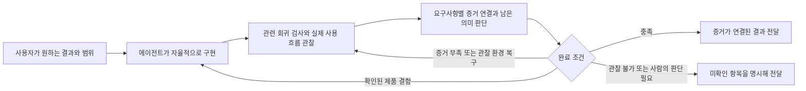

# 최근 실행으로 본 검증 비용과 에이전트 자율성

2026-09-08 후속 결정: 행별 결과를 보존하자는 권고는 승인된 [워크플로우 경량화 계획](../plans/2026-09-08-workflow-simplification.md)으로 대체되었다.
당시 수치와 사례는 역사적 측정 자료로 그대로 보존한다.

조사일: 2026-09-08.
조사 기준 소스: `0453cc134cf23ff140972c6dfb8d7f978181cc77`.
이 문서는 실행 기록을 읽고 작성한 검토안이며, 하네스 동작이나 실행 중인 run을 변경하지 않았다.
조사 도중 다른 세션이 `commands.ts`, `check-activity.ts`, `amend.ts`, `mechanical.ts`와 대응 테스트의 수정을 맡았다.
아래 코드 분석은 그 수정 전 기준이며, 해당 수정이 완료된 뒤의 상태를 평가한 것이 아니다.

## 판단

Sasu가 보장할 것은 사용자가 요구한 결과, 변경 권한, 완료 증거의 정직성이다.
구현 순서, 작업 분할, 도구 선택, 세부 검사 방법은 에이전트가 판단할 공간을 더 넓혀도 된다.
이를 위해 먼저 **요구사항을 기록하는 단위와 증거를 얻기 위해 실행하는 단위를 분리**하는 편이 좋다.

AC가 30개라는 것은 확인할 약속이 30개라는 뜻이다.
별도 테스트 파일 30개, 프로세스 30개, 독립 판정 모델 30개가 필요하다는 뜻은 아니다.
하나의 실제 사용자 흐름에서 여러 약속을 관찰하고, 각 약속이 어느 관찰로 충족됐는지를 남길 수 있다.
반대로 AC 수를 줄이려고 서로 다른 요구사항을 한 문장에 숨기는 것은 개선이 아니다.

지금 줄일 대상은 모든 테스트가 아니라 중복 실행, 검사를 위한 별도 구현, 동일한 사실의 반복 판정, 하네스 복구를 위한 수작업이다.
실제 사용 중 드러난 결함, 권한과 데이터 경계, 구현 누락을 잡는 검증은 유지할 가치가 있다.

## 조사 범위와 해석 한계

기간은 한국 시각 2026-09-01 00:00부터 2026-09-08 오전 조사 시점까지다.
첫 관찰 시각은 08:26:25이며, 작업 중인 기록은 이후 읽은 스냅샷의 시각과 구분한다.
로컬 프로젝트의 `agents/runs`, 구형 `agents/implement`, PRD와 보존된 세션 기록을 읽었다.
실행 명령이나 앱을 새로 돌리지 않았다.

Claude Code와 Codex를 모두 조사했다.
세션 탐색에서는 Codex 9월 1-8일 디렉터리의 rollout 97개와 Claude 프로젝트 아래 JSONL 1,306개를 후보 목록으로 확인했다.
이는 1,403개 세션을 모두 정독했다는 뜻이 아니다.
본문의 핵심 타임라인은 Claude 구현·관찰 세션 4개와 Codex 구현 세션 2개이며, 각 경로는 마지막 근거 목록에 남겼다.
프롬프트에 Sasu가 등장하기만 한 기록, 중첩 subagent, judge subprocess는 독립 구현 세션으로 세지 않았다.

완료되지 않은 run을 제품 실패로 세지 않는다.
중단, 이관, 다른 작업으로 대체, 증거 미등록, 실행 환경 오류도 완료되지 않은 상태를 만든다.
파일 수정 시각만으로 해당 기간에 제품 구현이나 검증이 실행됐다고 판단하지 않는다.
기간 안에 행정적으로 retired 처리된 오래된 run과, 실제 검사 이벤트가 발생한 run을 구분한다.

총 경과 시간에는 사람의 부재와 다른 작업 시간이 섞인다.
검사별 `durationMs` 합계에는 병렬 실행과 통합 검증 내부의 중첩이 섞인다.
따라서 이 조사에서는 그것을 구현 시간과 나누어 검증 비율이라고 부르지 않는다.
현재 벤치마크 보고기의 fallback 역시 실행 시간 합을 총 경과 시간에서 차감하므로, `unattributedSeconds`는 구현 시간이 아니다.
근거: [`benchmark_report.js`](../../skills/benchmark-implement/scripts/benchmark_report.js#L550).

## 집계와 대표 사례

4개 로컬 루트에서 찾은 `state.json` 후보 2,234개에서 fixture, 테스트, 비관련 상태, 오래된 복사본을 제외했다.
기간 안에 기록상 활동이 있는 고유 run은 18개였고, 그중 2개는 과거 run의 retirement 처리뿐이었다.
실제 생성·검사·검증·완료 활동을 집계한 표본은 **16개 run**이다.
프로젝트 구성은 Herdr IDE 13개, Sasu 2개, Sticky Notes 1개다.
일반 웹서비스의 최근 실전 표본은 확보하지 못했으므로 웹서비스 전체로 일반화할 수 없다.

| 관측값 | 기간 내 집계 | 해석 |
| --- | ---: | --- |
| 실질 활동 run의 Behavior/AC | 292행 | `check`, `judge`, `human`을 포함한 요구사항 수 |
| 행별 command check | 1,307회 | 명시 실행과 통합 검증 내부 실행을 포함한 기록 |
| 통합 verify | 65회 | PASS 17, FAIL 37, ERROR 11 |
| 통합 verify 관측 구간 | run별 합집합을 합해 351.3분 | 병렬 lane 시간을 더하지 않은 run-minutes, 절약 가능 시간은 아님 |
| receipt가 있는 run | 7개 | 완료율이 아님, active·retired·작업 중 상태가 섞임 |

행별 check의 실행시간 합은 106.2분이지만 통합 verify 안에 포함된 실행도 있어 351.3분에 더하지 않는다.
run 사이의 동시 실행도 있으므로 351.3분은 이 컴퓨터에서 순차적으로 지나간 시간이라는 뜻이 아니다.
검사를 새로 작성한 시간, UI를 조작해 증거를 모은 시간, 오류 복구와 재구현 시간은 이 숫자에 온전히 들어 있지 않다.
집계 원본의 필요한 필드와 출처 해시는 [실행 목록](2026-09-08-run-inventory.json)에 보존했다.

| 사례 | 버전·규모 | 관측 | 판단 |
| --- | --- | --- | --- |
| `gate-loop` | v7, AC 16 | check 112회, verify 7회·16.6분 | 초기 suite 호출 계약과 증거 연결 실패가 있었고, 이후 위험 검토는 P0 유실과 freshness 결함을 발견 |
| `prd-template` | v7, AC 17 | check 193회, verify 6회·58.6분 | 동일 후보의 직전 검사와 verify 내부 검사가 겹침, 원자성 수정과 재검토가 연쇄적으로 진행 |
| `hide-paths-and-tab-perf` | v7, AC 16 | check 169회, verify 15회·45.5분 | 세션에 7분 동안 27회 이상의 check 호출과 sandbox/toolchain 환경 복구가 남음 |
| `hide-design-system` | v7, AC 20 | check 142회, verify 6회·44.1분 | 실제 화면·접근성 문제를 발견했지만 한 attempt는 25.9분 뒤 judge timeout |
| `unlimited-sticky-notes` | v8, B 18 | check 21회·22초, verify 1회·221초 | 작은 테스트 비용보다 증거 수집·등록·판정 및 도구 복구가 두드러짐 |
| `hide-worktree-per-task` | v8, B 41 | cutoff까지 check 141회, verify 3회·20.8분 | 같은 명령을 여러 행이 호출하며, 전 행 통과 뒤에도 실제 데이터 손실 위험이 발견됨 |

이 표의 verify 횟수는 state에 남은 attempt 수다.
마지막 사례의 Codex transcript에는 cutoff 전에 verify 명령 호출이 4번 보이지만 state에 기록된 attempt는 3개다.
시작 전 거부된 명령 호출을 실제 실행된 attempt와 혼동하지 않았다.
활성 run은 조사 중 계속 진행됐으며, 뒤에 읽은 스냅샷의 check 169회를 cutoff 집계 141회와 섞지 않았다.

### 검증이 재구현을 만들었던 사례

`prd-template`의 6회 verify는 매번 source fingerprint가 달랐다.
따라서 새 후보에 전체 회귀 검사를 다시 수행한 사실 자체는 낭비의 증거가 아니다.
전체 suite는 verify 구간 중 33.0분을 차지했고, 최초 실패는 임시 디렉터리와 gitignore가 충돌하는 실제 격리 결함이었다.

다만 그 이후 acceptance와 fidelity는 판정을 실행한 5회 모두 통과했는데, close/write 경계에 관한 risk와 구조 검토가 수정 범위를 계속 넓혔다.
Claude 세션은 원자성 수정, lock 도입, 다른 writer까지 lock 확대, 기존 결정과의 충돌 발견, 두 lock commit의 revert, 더 단순한 staged close 순서를 보여준다.
실제 위험을 잡은 가치와, 수정할 때마다 새 설계를 만들고 다시 공격하는 반복 비용이 함께 존재한다.
새 finding이 나오면 먼저 기존 제품 결정과 대조하고, 확인된 실패를 재현 가능한 경계 검사로 고정하는 것이 다음 리뷰의 범위를 좁힌다.
검토 횟수만 제한해서 알려진 원자성 결함을 통과시키는 것은 해결이 아니다.

### 작은 앱에서 실제로 무거웠던 부분

Sticky Notes의 7개 기계 검사 행은 합쳐서 21회·약 22초였고, 마지막 전체 `swift test`는 1.048초였다.
통합 verify는 221.136초, acceptance lane은 186.779초였다.
그 긴 lane에는 judge의 허용된 읽기 명령 위반, 재시도와 fallback이 포함돼 있다.
이 사례에서 단위 테스트부터 삭제하는 것은 큰 병목을 건드리지 못한다.

10개 judge 행을 위해 qa brief 10개와 trail 10개가 만들어졌고, trail의 artifact 경로 참조는 합계 33개였다.
이는 서로 다른 artifact 33개를 새로 생성했다는 집계가 아니다.
최초 trail 등록 묶음은 artifact를 먼저 등록해야 한다는 순서 제약으로 거부돼 다시 등록됐다.
또 B8은 굵게·목록·체크리스트·링크와 보존, B12는 전체 화면·Space·마우스 화면·다중 모니터, B16은 접근성·한글 undo/redo·최소 창 크기 등을 한 행에 품었다.
**행을 적게 만든 것만으로 검증이 가벼워지지 않는다.**
각 약속의 관찰 결과는 구분하되, 같은 사용자 흐름에서 얻은 증거를 공유해야 한다.

이 앱에는 실제로 단축키 이전이 production 경로에 연결되지 않은 문제도 있었다.
저장 원자성, 영구 삭제, 다른 앱의 단축키 설정과 롤백은 앱의 외형이 작아도 중요한 계약이다.
약 4시간의 run 전체에는 사용자 피드백에 따른 UI와 동작 변경이 섞여 있어 그 전체를 하네스 지연이라고 볼 수 없다.

### 별도 위험 검토가 필요했던 반례

`hide-worktree-per-task`는 28개 check 행과 13개 judge 행이 모두 통과한 뒤에도 risk finding RF3가 남았다.
기록된 내용은 ignored 파일을 확인하지 않은 채 checkout하여 복구할 수 없는 덮어쓰기를 일으킬 수 있다는 것이다.
앞선 RF1은 다른 client의 worktree 정리 권한, RF2는 안전하지 않은 복구 명령을 다뤘다.
이 사례의 active 상태를 단순한 완료 절차 지연으로 해석하면 틀린다.
행별 합격이 놓친 위험을 찾는 검토는 실제로 가치를 냈다.

## 최신 업데이트가 해결한 것과 남긴 것

9월 6일 `71df6c7`의 Behaviors 전환은 Requirements, AC, Tasks, Verification 등의 중복 연결을 줄였다.
진행과 결과는 한 행에 모으고, 작업 분해는 implementor에게 맡긴 방향은 유지하는 편이 좋다.
구형 R/AC/T/V 문서로 돌아가는 것을 권하지 않는다.

그러나 실행 공유는 오히려 후퇴했다.
9월 3일 `798e7ec`은 AC check와 suite의 같은 `(cwd, command)`를 한 번 실행해 여러 AC와 suite에 결과를 연결했다.
9월 6일 전환은 그 planner를 suite 전용으로 바꾸고, check 행은 verify 전에 각각 실행하도록 바꿨다.
현재 기준 코드는 check 행 전체가 현재 product digest에서 green이어야 verify를 시작한다.
verify 자체가 check 행을 다시 돌리는 것은 아니지만, source가 바뀌면 에이전트가 행별 check를 다시 실행해야 한다.
그 뒤 전체 suite는 별도로 실행된다.
근거: [`runner.ts`](../../cli/src/implement/runner.ts#L40), [`commands.ts`](../../cli/src/implement/commands.ts#L2696), 해당 두 커밋의 diff.

최신 41행 PRD의 check 28개는 서로 다른 명령으로는 23개다.
`WorktreeMenuTests`는 B1/B19/B20, `WorktreeSheetTests`는 B3/B11, `WorktreeSheetSubmissionTests`는 B7/B8/B14가 공유한다.
이 세 명령은 한 관찰 묶음에서 각각 한 번 실행하고 8개 행에 결과를 연결할 수 있는 구체적 후보다.
과거에 같은 source hash로 실행한 결과를 무조건 캐시하자는 뜻은 아니다.

judge 행은 기준 코드에서 행마다 모델 호출을 하나씩 만든다.
check 행도 acceptance 결과에 나타나지만 이는 실행 결과의 전사이며 추가 모델 호출이 아니다.
최신 41행 사례의 통합 판정 한 번은 acceptance 모델 13개와 fidelity·design·risk lane을 사용한다.
원시 acceptance 항목 수를 모델 호출 수로 세면 비용을 크게 부풀리게 된다.
근거: [`commands.ts`](../../cli/src/implement/commands.ts#L2497), [`commands.ts`](../../cli/src/implement/commands.ts#L2609).

`quick`에는 이미 동일 명령 실행 공유와 최대 8개 AC를 한 lane에서 판정하는 구현이 있다.
`please`는 사용자에게 되묻는 횟수를 줄이지만 전체 implement 검증 계약은 유지한다.
따라서 자율 실행을 허용했다고 검증 비용도 줄어드는 것은 아니다.
새 경량 모드를 만들기보다, 기존 실행 공유를 Behaviors 아래로 가져올 근거가 충분하다.
이미 PRD가 있는 작업을 `quick`으로 우회하는 것은 현재 계약에도 맞지 않는다.
근거: [`mechanical.ts`](../../cli/src/mechanical.ts#L272), [`gates/commands.ts`](../../cli/src/gates/commands.ts#L161), [`please/SKILL.md`](../../skills/please/SKILL.md#L44).

설치된 `sasu`는 별도 배포본이 아니라 이 checkout의 `cli/dist/cli.js`를 가리키며 계약 버전은 `0.8.0`이었다.
조사한 Codex 설치 skill 3개는 checkout과 일치했다.
Claude 설치본에는 정상적인 런타임 문법 변환 외에도 gate reopen, amend 권한, check 명령, await 설명의 차이가 있었다.
따라서 두 런타임의 행동 차이를 모델 성능 차이로 바로 해석할 수 없다.
현재 설치본 차이는 과거 각 세션이 어떤 skill을 실제로 읽었는지까지 증명하지는 않는다.

## 자율성과 완료 규칙의 경계

에이전트가 자율적으로 결정할 항목과 하네스가 고정할 항목은 다음과 같다.

| 에이전트가 결정 | 하네스가 고정 |
| --- | --- |
| 구현 순서와 내부 작업 분할 | 사용자가 승인한 결과와 범위 |
| 코드 구조와 사용 도구 | 실행 권한과 변경 소유 경계 |
| 어떤 흐름으로 여러 요구사항을 확인할지 | 각 요구사항에 실제 증거 또는 명시적인 미확인 상태가 있음 |
| 기존 테스트 재사용과 필요한 새 테스트 | 실행 실패를 성공으로 기록하지 않음 |
| 증거의 의미와 추가 관찰 필요성 | 어떤 소스와 환경에서 얻은 결과인지 기록 |
| 확인된 결함을 고치는 방법 | 사람의 판단을 에이전트의 승인으로 대체하지 않음 |

매번 같은 명령 순서로 작업하도록 만드는 것과 결과를 믿을 수 있게 만드는 것은 다르다.
모델 판정은 많은 규칙으로 감싸도 확률적 판단이다.
결정적으로 만들 수 있는 것은 기록의 무결성, 권한, 검사 실행 결과의 취급, 미확인 항목을 PASS로 바꾸지 않는 완료 조건이다.
제품 의미의 판단에는 모델과 사람의 역할이 남는다.

화살표는 필요한 데이터 의존성을 나타낸다.
독립적인 검사와 관찰은 병렬로 실행할 수 있다.
수정 시에는 영향을 받은 증거의 유효성을 다시 판단하며, 위 그림을 모든 단계를 무조건 처음부터 반복하는 명령 순서로 구현하면 안 된다.

## 먼저 줄일 것

### 1. 하나의 관찰을 여러 행이 공유하게 한다

같은 앱 상태, 같은 fixture, 같은 사용자 흐름을 보는 행은 관찰을 공유한다.
각 행의 관찰 지점과 실패 원인은 유지한다.
예를 들어 생성, 편집, 저장, 다시 열기를 한 번 수행하면서 각각의 기대 결과를 확인할 수 있다.
단순히 “이 흐름이 여러 AC를 커버한다”는 선언이나 프로세스의 exit 0만으로 개별 행의 의미까지 증명했다고 보지는 않는다.

이미 있는 테스트 결과와 실행 증거를 먼저 사용한다.
결과를 연결하려고 별도 자기보고용 PASS JSON 스크립트를 만드는 것은 피한다.
일회성 UI 확인은 실제 화면과 동작 증거로 끝낼 수 있으며, 모든 문구와 배치에 영구 테스트 파일을 추가할 필요는 없다.

### 2. 마지막 검증을 한 번의 관찰 묶음으로 구성한다

개발 중 필요한 테스트는 에이전트가 수시로 실행한다.
마지막에는 현재 결과물에 필요한 기존 회귀 검사, 실제 사용자 흐름, 남은 의미 판단을 한 번 구성한다.
같은 결과를 행별 검사, 전체 검사, 별도 판정에서 다시 얻고 있다면 중복을 제거한다.
전체 회귀 검사가 잡는 실패와 개별 행 검사가 잡는 실패가 다르면 둘 다 유지한다.

이 제안은 “종료 직전에는 무조건 한 번만 검사한다”는 새 횟수 제한이 아니다.
실패와 수정이 있으면 재검증이 필요하다.
수정 이유, 영향을 받은 범위, 다시 확인해야 할 사실이 다음 실행을 결정하게 한다.
행별 check를 미리 모두 green으로 만드는 완료 관문을 없애고, verify가 unique check와 suite의 최종 관찰을 함께 소유하도록 하는 것이 첫 구현 후보이다.
개발 중의 focused check는 자유롭게 수행하되 별도의 완료 권한으로 중복 관리하지 않는다.

### 3. 증거 부족과 실행 환경 오류를 제품 결함에서 분리한다

명령 연결이 없거나 증거 파일이 접근 불가능한 상태는 제품 로직을 수정하라는 신호가 아니다.
잘못된 호출 계약은 실행 전에 알려주고, 실행 환경 문제는 그 경계에서 해결하게 한다.
복구 후 제품에 변화가 없었다면, 유효한 다른 관찰까지 폐기해야 하는지 따져야 한다.
실행되지 않은 항목을 PASS로 만드는 예외는 추가하지 않는다.

### 4. 독립 검토는 남은 실패 가능성에 집중시킨다

실행 증거만으로 닫히지 않는 요구사항 누락, 중요한 위험, 실제 UX 품질에는 독립적인 검토가 도움이 된다.
이미 관찰한 사실을 행마다 다시 설명하고 평가하는 호출은 줄일 후보이다.
여러 행을 묶더라도 한 판정에 무관한 전체 변경을 몰아넣지 말고, 공통 맥락과 증거가 있는 범위로 나눈다.

새 검토가 매번 새 권고를 만들고, 그 권고를 반영할 때마다 전체 검토를 새로 시작하는 구조는 끝이 없다.
기존 finding과 수정 내용을 이어 보고, 필수 요구사항 위반과 선택적 개선을 구분해야 한다.
알려진 중요한 결함은 횟수 제한 때문에 PASS 처리하면 안 된다.
수렴하지 않는 항목은 미해결로 남겨 사람이 판단할 수 있어야 한다.

### 5. 전체 소스 해시만 보고 재사용하지 않는다

첫 개선은 같은 관찰을 여러 행이 사용하는 것으로 제한하는 편이 단순하고 안전하다.
다른 시점의 증거 재사용은 더 어려운 문제다.
소스가 같아도 DB, 외부 서비스, ignored 파일, 설치된 앱 번들, 환경이 달라질 수 있다.
파일 경로가 겹치지 않는다는 이유만으로 영향이 없다고 판단할 수도 없다.
현재 관찰에 영향을 주는 입력을 충분히 설명할 수 있을 때에만 재사용하고, 불명확하면 해당 관찰을 다시 수행한다.

## PRD에서 바꿀 관점

PRD는 사용자가 원하는 결과와 의미 있는 예외를 표현해야 한다.
변수, 헬퍼 함수, 작업 순서, 내부 위임 여부를 행으로 늘리는 방향은 피한다.
어떤 구현을 선택해도 지켜야 하는 결과가 좋은 Behaviors 행이다.

행마다 검사 방법이 있는 최신 형식은 활용하되, 행마다 새로운 검사 프로그램을 작성하라는 뜻으로 읽지 않아야 한다.
검사 방법은 기존 증거 또는 같은 흐름에서 얻을 관찰을 가리킬 수 있어야 한다.
검증이 어렵다는 이유만으로 핵심 요구사항을 삭제하거나 `human`으로 보내지는 않는다.

| 요구사항 종류 | 적절한 증거의 기본 방향 |
| --- | --- |
| 계산, 자격, 상태 전이, 권한, 데이터 손실 | 기대값이 제품 규칙에서 나온 경계 검사 |
| 저장, 복구, 외부 시스템 연동 | 실제 결과 상태를 확인하는 통합 경로 |
| 버튼, 목록, 입력, 화면 전환 | 하나의 사용자 흐름에서 여러 결과를 관찰 |
| 문구, 여백, 단순 표시 | 해당 화면에서 직접 확인하며 필요 없는 영구 테스트는 추가하지 않음 |
| 선호, 디자인 방향, 제품 해석 | 명시된 기준과 사람이 판단할 부분을 구분 |

이는 사용자에게 새 위험 등급, 검증 개수, 실행 모드를 설정하게 하자는 제안이 아니다.
기존 요구사항을 읽고 적합한 증거를 고르는 책임을 에이전트와 하네스 내부에 둔다는 뜻이다.

### 실제 Sticky Notes PRD를 적용한 예

18개 Behavior를 그대로 두고 다음 흐름에서 관찰을 공유할 수 있다.
이 표는 새로 승인된 PRD나 실제 수행 결과가 아닌, 현재 요구를 보존하는 검사 구성 예시다.

| 관찰 묶음 | 실제 흐름 | 연결할 결과 |
| --- | --- | --- |
| 메모 작성과 복구 | 빈 상태, 여러 노트 생성, 서식·이미지 입력, 노트 왕복, 검색, 재실행, 삭제·복원 | B1-B6, B8-B10 |
| 앱 호출과 창 상태 | 마우스 화면에 창 열기, 기억한 위치·크기 복원, 화면 밖 보정, 다른 앱에서 표시·숨기기, 전체 화면·Space 호출, 중복 실행 | B7, B11-B13 |
| 설치와 위험 경계 | 창 위치 보정의 기하 경계 검사, 단축키 이전·실패 롤백, 로그인 실행, 접근성·한글 편집, 오프라인·무전송·번들 | B7의 자동 검사, B14-B17 |
| 최종 사용감 | 사용자의 실제 사용 판단 | B18 |

자동 검사는 저장 원자성, 영구 삭제, 단축키 롤백처럼 화면만으로 확인하기 어려운 경계에 유지한다.
B8의 링크 보존 증거가 없으면 그 결과를 미확인으로 남기고, 같은 흐름에서 관찰한 체크리스트 보존 결과까지 버리지 않는다.
물리 다중 모니터나 접근성 드라이버를 사용할 수 없었다면 이를 제품 실패나 성공으로 바꾸지 않고 관찰 한계로 기록한다.
새 명세 필드와 하위 ID 체계를 사용자에게 작성하게 할 필요는 없으며, 기존 행의 기대 결과와 관찰 지점 연결을 내부 증거가 표현하면 된다.

## 원칙과의 관계

저장소 원칙 1과 2는 함께 적용한다.
모든 요구사항의 충족 여부를 추적하면서, 중복 관찰과 장부 작업은 줄인다.
다만 원칙 1의 “가능한 가장 강한 도구를 끝까지 찾는다”는 문구는 적정한 관찰 이후에도 검증을 계속 늘릴 유인이 있다.
**“요구한 사실을 충분히 구별할 수 있는 증거를 얻고, 추가 검사가 잡을 별개의 실패가 없으면 멈춘다”**는 방향으로 문구를 바꾸는 것을 제안한다.
이는 현재 규칙의 해석만으로 이미 허용된다고 주장하는 것이 아니라, 규칙 수정 제안이다.

원칙 6은 의미 단위를 강조하지만, 설명에서 판정 단위를 AC 하나로 고정한다.
이를 **“판정 결과는 요구사항별로 남기고, 실행과 모델 호출은 공통 의미와 증거가 있는 요구사항을 묶는다”**로 분리하는 편이 좋다.
원칙 4에 따라 새 묶음 개념을 넣는다면 개별 행마다 중복된 실행과 재판정 경로를 함께 없애야 한다.
원칙 5에 따라 입력의 순수성이 확인되지 않은 검사는 해시가 같다는 이유로 생략하지 않는다.
원칙 13에 따라 생성적 리뷰의 재시작에는 수렴 경계를 둔다.

공통 엔지니어링 원칙 2와 7에 따라 기존 실행기와 증거 구조를 확장하고, 별도 경량 하네스나 설정 계층을 만들지 않는다.
엔지니어링 원칙 12에 따라 테스트의 개수보다 잡을 수 있는 실제 결함과 유지 비용을 판단한다.
코드 기반 자동 판정과 의미 판단을 구분하는 것은 저장소 원칙 7도 따른다.

## 모델이 바뀔 때 확인할 것

모델이 좋아졌다는 이유만으로 모든 검토를 없애거나, 기존 단계를 영구히 유지하지 않는다.
새 모델에서 가치가 줄어든 단계를 실제 작업으로 확인하고 하나씩 제거한다.
가벼운 UI 수정, 상태가 있는 작은 앱, 권한이나 데이터가 중요한 변경처럼 성격이 다른 사례를 비교하면 충분한 출발점이 된다.

먼저 현재 방식과 관찰 공유 방식의 차이 하나만 비교한다.
동일 요구사항과 시작 상태, 모델 설정, 실행 환경을 기록하고, 결과의 누락과 실제 사용 결함을 사람이 포함된 동일 기준으로 평가한다.
작업 범위나 모델까지 동시에 바꾸면 하네스를 가볍게 해서 얻은 효과인지 알 수 없다.

볼 지표는 완료까지의 실제 작업 시간, 관찰 구간의 합집합 시간, 모델 호출 비용, 하네스 복구 횟수, 놓친 요구사항과 중요한 결함이다.
작은 초기 표본으로 보편적인 속도 개선율이나 안전성을 선언하지 않는다.
비교 절차는 하네스를 평가할 때 수행하고, 모든 제품 작업의 새로운 필수 단계로 넣지 않는다.

이 방향은 외부 실험과도 맞는다.
Anthropic은 모델 교체 후 스프린트 구조와 매 스프린트 평가를 제거하고, 구성요소를 하나씩 빼며 효과를 살폈다고 보고했다.
동시에 마지막 평가가 실제로 동작하지 않는 핵심 기능을 계속 발견했다고 설명한다.
이는 Sasu의 개선율을 증명하는 자료가 아니라, 단계의 효용을 다시 측정하라는 설계 근거다.
출처: [Harness design for long-running application development](https://www.anthropic.com/engineering/harness-design-long-running-apps).

고정된 도구 호출 순서보다 최종 환경의 결과를 평가하고, 가능한 사실은 코드로 검사하며 의미 판단에는 모델과 사람을 사용하는 구분도 참고할 만하다.
출처: [Demystifying evals for AI agents](https://www.anthropic.com/engineering/demystifying-evals-for-ai-agents).

## 권고 순서와 삭제할 것

| 순서 | 변경 제안 | 함께 없어져야 할 것 | 유지할 증명 |
| --- | --- | --- | --- |
| 1 | 기존 명령·경로 검증을 dispatch 전에 재사용 | 구현 뒤 같은 문법 오류를 발견해 restart·gate reopen하는 복구 절차 | 실제 check와 같은 호출 계약 |
| 2 | Behaviors check와 suite의 unique 실행 공유 복원 | 행별 사전 green 관문, 같은 관찰의 중복 프로세스와 독립 freshness 관리 | 행별 결과와 현재 후보의 회귀 검사 |
| 3 | 공통 증거가 있는 judge 행의 bounded 묶음 실행 | 행 하나마다 별도 모델 프로세스를 띄우는 기본값 | 행별 근거와 판정, 제한된 증거 접근 |
| 4 | 실제 사용자 흐름으로 QA 증거 공유 | 같은 PRD 문장을 복제한 여러 brief와 같은 상태의 반복 캡처·등록 | 흐름의 각 기대 결과에 대응하는 실제 관찰 |
| 5 | 일반 작업의 구조 개선 권고를 완료 차단에서 분리 | 사소한 구조 권고까지 수용·재판정해야 하는 반복 | 필수 동작 위반과 중요한 위험은 계속 차단 |

먼저 1-2번을 작은 변경으로 구현하는 것이 좋다.
새 형식은 유지하면서 이미 존재하던 실행 공유를 복원하는 작업이라 변경 범위와 삭제 대상을 분명히 할 수 있다.
3-5번은 판정의 질에 영향을 줄 수 있으므로 각각 실제 사례에서 분리해 비교해야 한다.
정확한 절약률은 이 조사만으로 제시할 수 없다.

지금 필요한 방향은 새 모드와 예외 명령을 늘리는 것이 아니다.
**결과에 대한 계약은 유지하고, 결과를 얻고 확인하는 과정의 중복을 하네스가 없애는 것**이다.

## 근거 찾기

로컬 run의 원본은 진행 중 변경될 수 있다.
행 수·상태·시각·집계 필드·읽은 원본의 SHA-256은 [실행 목록 JSON](2026-09-08-run-inventory.json)에 있다.
구형 v7 행 검사 이력은 `acceptanceCriteria[].check.attempts[]`, v8은 `rows[].attempts[]`, 통합 검증은 `verificationAttempts[]`에서 읽었다.
설계 lane의 `verdict`는 결과가 `comments: []`인 경우에도 FAIL로 기록된 사례가 있어, 그 값만으로 부정적 리뷰 횟수를 세지 않았다.
실제 구조 검토 내용은 comments와 severity, disposition으로 확인했다.

| 자료 | 경로 또는 식별자 | 이 문서에서 사용한 내용 |
| --- | --- | --- |
| Sasu 자체 개발 | `/Users/hoyeonlee/projects/sasu/agents/runs/{gate-loop,prd-template}/state.json`, 각 run의 `prd.md` | attempt 시간, check 횟수, risk와 design 수정 |
| 네이티브 실행 | `/Users/hoyeonlee/projects/herdr-ide/agents/runs/<topic>/state.json` | 표에 나온 각 topic의 검사와 실제 위험 finding |
| 최신 41행 PRD | `/Users/hoyeonlee/projects/herdr-ide/agents/prd/hide-worktree-per-task/prd.md:87` | B행 종류, 같은 명령의 중복 사용 |
| Sticky Notes | `/Users/hoyeonlee/projects/sticky-notes/agents/runs/unlimited-sticky-notes/state.json`, `agents/prd/unlimited-sticky-notes/prd.md:65` | 18행의 실제 범위, 증거와 실행 비용 |
| Claude, PRD 전환 구현 | `~/.claude/projects/-Users-hoyeonlee-projects-sasu/425bf9f0-de30-4c6c-8fa3-99e64bf41e22.jsonl` | 9월 6일 11:17-12:48 UTC, 6회 verify와 lock 도입·revert |
| Claude, gate-loop 구현 | `~/.claude/projects/-Users-hoyeonlee-projects-sasu-worktrees-gate-loop/a039ada2-f619-4d01-8ce0-5dc34015eb7d.jsonl` | 9월 3일 15:32-16:05 UTC, suite 실패 뒤 반복 진단 |
| Claude, 경로·성능 구현 | `~/.claude/projects/-Users-hoyeonlee-projects-herdr-ide/be05eb21-e924-480a-8306-7ce8fe68de3e.jsonl` | 9월 4일 17:59-18:06 UTC, sandbox/toolchain 복구 |
| Claude, worktree Observer | `~/.claude/projects/-Users-hoyeonlee-projects-herdr-ide/3e06fe85-0c5c-4673-9b1f-0ec85b7eb3d9.jsonl` | 9월 7일 gate 순서·명령 수정, gap-audit 6/spec 4 cycle |
| Codex, worktree 구현 | `~/.codex/sessions/2026/09/07/rollout-2026-09-07T20-26-34-01a07b9e-b71e-7a32-80de-ee01a970833c.jsonl` | 9월 7일 28행 검사 batch와 실제 native QA |
| Codex, Sticky Notes 구현 | `~/.codex/sessions/2026/09/07/rollout-2026-09-07T21-12-05-01a07bc8-628d-7a00-b205-f4902e51fdee.jsonl` | 9월 7일 16:09 UTC trail 등록 복구, 16:27 UTC 미완료 종료 거부 |

6개 조사 메모는 `/tmp/sasu-audit-20260908/`의 `inventory.md`, `current-contract.md`, `sasu-cases.md`, `native-cases.md`, `service-cases.md`, `transcript-costs.md`에 남겼다.
이 문서는 메모를 단순 합친 것이 아니라, 집계 단위·시각·버전·실패 원인의 차이를 교정한 종합본이다.
