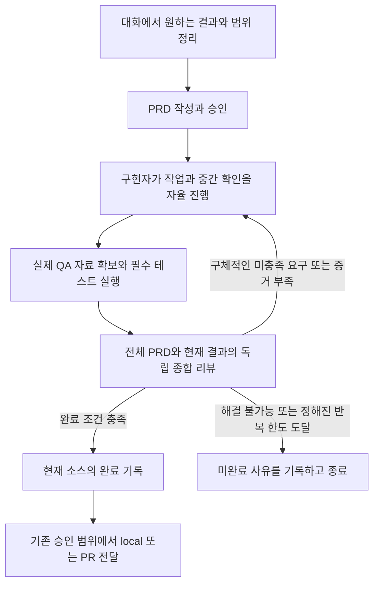

# Sasu 워크플로우 경량화 변경 계획

작성일: 2026-09-08.
조사 기준: `d2aef7ec4c23c309532ba78a6b5ffed3249f224f`.
상태: 구현 전 계획안.
이 문서는 현재 동작과 바꿀 동작을 구분하며, 코드·설치된 skill·실행 중인 run을 변경하지 않는다.

빠르게 읽으려면 1장의 방향, 4장의 예시, 6장의 CLI 표, 14장의 skill 표를 먼저 보면 된다.
구현할 때는 13장의 파일 지도, 16장의 검증, 18~19장의 작업·전환 순서를 사용한다.

## 1. 바꾸려는 것

**요구사항은 전부 구현하고 전부 독립적으로 검토하되, 요구사항마다 CLI 통과 도장을 받는 절차는 없앤다.**

요구사항이 30개라면 PRD에는 여전히 30개가 남는다.
구현자는 30개를 만족하는 제품을 만들고, 독립 리뷰어는 전체 PRD와 실제 구현·테스트·관찰 자료를 비교한다.
CLI가 관리하는 것은 30개의 PASS가 아니라 필수 테스트 실행, 증거 파일의 무결성, 발견된 문제, 현재 소스에 대한 종합 리뷰, 최종 완료 기록이다.

| 구분 | 현재 | 변경 후 |
| --- | --- | --- |
| PRD | 행동마다 검사 방법을 미리 고정 | 원하는 행동과 결정 근거를 기술 |
| 구현 진행 | 행동 행마다 상태·시도·중단·재개 기록 | 구현자가 작업 순서와 중간 확인 방법을 결정 |
| 실제 확인 | 행에 연결한 명령·자료·QA 절차 | 필요한 테스트와 사용자 흐름을 묶어서 실행 |
| 요구사항 누락 확인 | 행별 acceptance와 별도 fidelity | 전체 요구사항을 읽는 독립 종합 리뷰 |
| 리뷰 결과 | 행별 PASS/FAIL과 여러 lane 결과 | 발견된 문제와 실행 전체 결과 |
| 최종 완료 | 행별 상태와 여러 검토 조건을 합산 | 필수 테스트, 현재 입력의 리뷰, 미해결 문제, 승인 상태로 결정 |
| 사용자에게 보고 | 30개 중 30개 통과 | 무엇을 구현했고, 무엇을 실제 확인했고, 무엇이 남았는지 설명 |

없애는 것은 요구사항이 아니라 요구사항마다 반복되는 관리 절차다.
다만 이것을 단순한 성능 최적화로 설명해서도 안 된다.
기존의 행별 증명 계약을 전체 요구사항에 대한 의미 판단으로 바꾸므로, CLI가 기계적으로 보장하는 범위도 달라진다.
모델의 판단이 더 많은 책임을 맡는 만큼 실제 누락을 심은 평가로 품질을 확인해야 한다.

## 2. 조사 범위와 근거

저장소의 진입점, 실행 상태, PRD와 gate, judge 실행기, 인터뷰, 전달, 벤치마크, 설치기, skill, 테스트와 예제의 연결을 조사했다.
네 개의 병렬 조사에서 실행 상태, PRD·리뷰 계약, 하위 소비자, 테스트를 나누어 확인했다.
전체 파일의 의존 관계를 파악하고 변경 경로를 깊게 읽었으며, 모든 소스 줄을 개별적으로 검토했다는 뜻은 아니다.

최근 실행 분석은 [기존 감사 문서](../audits/2026-09-08-verification-overhead.md)와 [실행 목록](../audits/2026-09-08-run-inventory.json)을 사용한다.
이 감사는 Claude Code와 Codex 세션을 모두 포함한다.
실질 실행 16개에서 요구사항 292개, check 실행 기록 1,307개, verify 시도 65개를 관찰했다.
표본은 Herdr IDE 13개, Sasu 2개, Sticky 1개에 치우쳐 있고, 일반적인 작은 웹 서비스의 대표 표본은 없다.
verify 구간의 합집합 시간을 실행별로 합친 351.3분은 절약 가능한 시간이나 구현 대비 검증 비율을 의미하지 않는다.

기존 감사의 “행별 결과를 보존하자”는 권고보다 이후 사용자 논의가 더 나아갔다.
이 계획은 **행별 결과 의무도 제거**한다.
감사 당시의 수치·사례는 보존하고, 구현할 때 권고가 후속 결정으로 바뀌었다는 날짜와 이 문서의 링크만 추가한다.

조사 기준에는 최근 동시 실행 결함 수정 `d2aef7e`가 포함된다.
과거 감사 시점에 있던 결함을 현재도 미수정이라고 설명하지 않는다.

외부 설계에서도 단계의 존속 여부를 모델 능력과 실제 효과로 다시 판단한 사례를 참고했다.
Anthropic은 장기 작업 하네스에서 끝단 평가를 유지하면서 별도 sprint 구성을 제거한 경험을 설명한다.
이 사례를 특정 구성의 정답으로 가져오지 않고, 단계별로 고유한 효용을 확인하는 근거로 사용한다.
[Harness design for long-running applications](https://www.anthropic.com/engineering/harness-design-long-running-apps).

또한 기계적 채점과 모델의 의미 판단을 구분하고 실제 환경의 결과를 평가한다는 접근을 따른다.
JSON 형식 검사는 리뷰어가 누락을 잘 찾는다는 증거가 아니므로 두 종류의 평가를 분리한다.
[Demystifying evals for AI agents](https://www.anthropic.com/engineering/demystifying-evals-for-ai-agents).

## 3. 전체 코드베이스에서의 위치

| 영역 | 주요 파일 | 현재 책임 | 변경 범위 |
| --- | --- | --- | --- |
| 공개 CLI | `cli/src/cli.ts`, `version.ts`, `doctor.ts` | 명령 라우팅, 계약 버전, 설치·run 진단 | 삭제 명령, 새 출력, 구형 계약 오류 반영 |
| PRD 공용 파서 | `cli/lib/prd_parser.js`, `qa_register.js`, `gate_freshness.js` | 문서 구조, 결정 출처, gate 입력 식별 | 검사 방법 문법 제거, 신선도 계약 변경 |
| PRD 생명주기 | `cli/src/prd/commands.ts` | readiness, ready, approve | 행 종류 집계 제거, 승인 구분 유지 |
| 문서·quick gate | `cli/src/gates/{commands,contract,prelint,prompts,store}.ts` | 문서 검토, quick 실행·리뷰 | spec 질문 변경, 중복 PRD verify 제거, quick 정렬 |
| 구현 실행 | `cli/src/implement/` | run, 행별 진행, suite, QA, 리뷰, 완료 | 이번 변경의 중심 |
| judge 기반 | `cli/src/judge/` | backend, 격리, 증거 접근, timeout, 기록 | 종합 결과 계약 추가·교체, 실행 안전장치 유지 |
| 명령 실행 | `cli/src/mechanical.ts`, `implement/runner.ts` | 실제 프로세스, 출력, 종료·정리 | 프로세스 보호 유지, 검증 실행권과 연결 |
| 인터뷰 | `cli/src/interview/` | 양쪽 runtime transcript, Q&A·결정 기록 | 원칙적으로 유지 |
| 규칙·설정 | `config.ts`, `principles/`, `support/`, `cli/lib/{rules,commands/}` | 프로젝트 설정, 규칙, 초기화 | 행별 검증 설명·소비 부분만 변경 |
| 실행 환경 | `implement/{dispatch,herdr,solver,waiter,events,worktree}.ts`, `runs/` | 역할, 위임, 복구, 이벤트, worktree | 행 target 참조 정리, 기존 역할·복구 유지 |
| 전달 | `skills/ship/scripts/prd_ship.js` | 완료 기록 검사, local/PR 전달, CI·merge | 새 receipt 소비와 본문 변경 |
| 벤치마크 | `skills/benchmark-implement/`, `benchmarks/` | 실행 평가·비교, 고정 workload | 행·lane 기반 schema와 지표 교체 |
| 에이전트 지침 | `skills/*/SKILL.md`, `references/`, `agents/openai.yaml` | 실제 실행 절차와 설명 | CLI와 같은 계약으로 동시 변경 |
| 설치·hook | `scripts/install-local-skills.mjs`, `cli/lib/skill-contract.js`, `scripts/hooks/` | 양쪽 runtime 설치, 구형 hook 회수 | 설치 신선도·계약 일치 확인, hook 추가 없음 |
| 문서·자산 | `AGENTS.md`, `PRINCIPLES.md`, `README.md`, `assets/implement-workflow.excalidraw` | 정책, 사용법, 흐름도 | 구현과 같은 변경에서 갱신 |
| 테스트 | `tests/`, `cli/test/unit/`, `cli/test/e2e/` | 공개 계약, 상태, 실제 CLI 경계 | 퇴역 개념 제거, 남는 완료 경계 중심 재작성 |

`implement`만 수정하면 끝나지 않는다.
특히 `ship`, 별도 `gate verify --prd`, 벤치마크가 현재의 행 상태와 결과를 직접 읽는다.
이 소비자들을 함께 바꾸지 않으면 구현이 끝나도 전달되지 않거나, 구형 skill이 삭제된 명령을 계속 호출한다.

## 4. 바뀐 흐름을 작은 예시로 보기

새 흐름의 기본 모양은 다음과 같다.



예를 들어 “메모를 만들고, 검색하고, 앱을 다시 열어도 남는 작은 서비스”를 만든다.
PRD의 Behaviors는 다음처럼 쓴다.

| # | 사용자가 관찰하는 행동 | 결정 |
| --- | --- | --- |
| B1 | 제목과 내용을 입력해 메모를 저장하면 목록에 나타난다. | D-01 |
| B2 | 저장한 메모를 다시 열면 입력한 내용이 보인다. | D-01 |
| B3 | 검색어와 일치하는 메모만 목록에 나타난다. | D-02 |
| B4 | 검색 결과가 없으면 빈 결과 안내와 검색어를 지울 방법을 보여준다. | D-02 |
| B5 | 앱을 종료하고 다시 열어도 저장한 메모가 남아 있다. | D-03 |
| B6 | 저장에 실패하면 오류를 알리고 입력 중이던 내용을 보존한다. | D-03 |

현재 방식이라면 각 행에 `check:`, `judge:`, `human:` 중 하나와 검사 방법을 적고 그 행을 닫는다.
변경 후에는 구현자가 적절한 방법을 골라 구현하고 확인한다.
예를 들어 저장·재열기·검색·빈 결과를 한 번의 사용자 흐름에서 확인하고, 저장 실패는 별도의 실패 주입 테스트로 확인할 수 있다.
재실행 후 보존은 실제 프로세스를 다시 시작해서 확인할 수 있다.
CLI는 이 자료들을 실행 전체에 연결하고 필수 프로젝트 테스트 결과를 수집한다.

독립 리뷰어는 B1부터 B6까지 모두 읽는다.
정상 흐름 영상만 있고 저장 실패 확인이 없다면, “B6은 구현과 관찰 근거가 부족하다”는 문제를 남긴다.
저장 함수는 있지만 실제 버튼에서 호출하지 않는다면, 코드가 존재해도 구현 누락으로 판단한다.
버튼 문구가 PRD와 다르면 작은 요구사항이어도 수정 대상이다.
반면 PRD와 무관하게 “검색창에 애니메이션을 넣으면 좋겠다”는 의견은 완료를 막지 않는다.

요구사항이 30개로 늘어도 방식은 같다.
30개 모두 검토하되, 실제 실행은 예를 들어 사용자 흐름 4개와 실패 테스트 몇 개로 묶일 수 있다.
4개는 규칙이나 상한이 아니라 설명을 위한 예시다.
요구사항의 위험과 성격에 따라 더 많은 관찰이 필요할 수도 있다.
리뷰 결과에는 발견된 B17의 저장 실패 누락과 B28의 미연결 메뉴 같은 문제만 남긴다.
30개의 빈 PASS 객체를 만드는 일은 하지 않는다.

## 5. PRD 계약 변경

### 5.1 여섯 섹션은 유지한다

`Goal`, `Non-goals`, `Decisions`, `Behaviors`, `Technical structure`, `Risks`를 유지한다.
새로운 필수 Verification Plan 섹션이나 R/AC/T/V 연결표를 추가하지 않는다.

| 섹션 | 쓰는 내용 | 쓰지 않도록 바꿀 내용 |
| --- | --- | --- |
| Goal | 사용자가 얻을 결과 | 하네스 통과 절차 |
| Non-goals | 이번에 하지 않을 범위 | 공통 저장소 규칙의 복제 |
| Decisions | 제품·정책 결정과 대화 근거 | 요구사항마다 고정한 검사 수단 |
| Behaviors | 빠짐없이 필요한 관찰 가능한 행동 | 검사 방법 열, 행별 상태·담당 검증자 |
| Technical structure | 실제로 지켜야 하는 구조·연동 경계 | 과도한 작업 순서나 파일별 지시 |
| Risks | 실제 위험, 외부 전제, 사람에게 남긴 판단 | 모든 요구사항의 증거 목록 |

행의 개수는 제품 내용이 결정한다.
리뷰 호출을 줄이려고 서로 다른 요구를 한 문장에 몰아넣거나, 30개를 억지로 5개로 줄이지 않는다.
반대로 하네스의 작업 단위를 만들려고 사소한 구현 동작까지 행으로 쪼개지 않는다.

### 5.2 파서와 spec gate

- `parseBehaviorRows`는 `id`, `behavior`, `decisionIds`, 원문 위치와 구조 오류만 반환한다.
- `CHECK_KINDS`, `parseCheckCell`, 행동 문장의 method-prefix 탐지와 네 번째 열 의존을 제거한다.
- 여섯 섹션, 필수 메타데이터, 비어 있지 않은 행동, Bn 중복, 결정 참조의 유효성은 유지한다.
- `commandCompositionDefect`는 프로젝트 필수 명령도 사용하므로 삭제하지 않는다.
- `prd readiness`의 `rowKinds`와 행 명령 검사는 `behaviorCount`, `decisionCount` 중심으로 바꾼다.
- spec gate는 “각 행의 검사 방법이 충분한가” 대신 요구의 명확성·관찰 가능성·범위·결정 일관성을 검토한다.
- 대화의 답변과 Decision Register, PRD 결정의 출처 연결은 유지한다.

`ready`는 작성 준비 완료이고, `approved`는 사람의 승인이다.
둘을 합치지 않으며 `implement start`의 승인 확인도 유지한다.
`dispatch.ts`가 아직 허용하는 구형 `status: approved` 분기는 현재 writer가 만들지 않으므로 함께 삭제한다.

### 5.3 완전한 예시의 문서 구조

아래는 구조 설명용 예시이며, 실행 가능한 승인 PRD가 아니다.
실제 문서는 기존 frontmatter와 인터뷰의 결정 근거를 채운다.

```markdown
## Goal
사용자가 짧은 메모를 보관하고 필요한 메모를 다시 찾는다.

## Non-goals
계정, 동기화, 공동 편집은 이번 범위에서 제외한다.

## Decisions
| # | 결정 | 근거 |
| --- | --- | --- |
| D-01 | 제목과 본문을 가진 메모를 저장한다. | 인터뷰의 저장 요구 |
| D-02 | 제목과 본문을 대상으로 검색한다. | 인터뷰의 검색 범위 결정 |
| D-03 | 로컬에 저장하며 저장 실패 시 작성 내용을 보존한다. | 인터뷰의 데이터 보존 결정 |

## Behaviors
위 예시의 B1-B6을 세 열짜리 표로 기록한다.

## Technical structure
기존 저장 계층과 화면 구조를 확장한다.

## Risks
저장 장치 오류를 정상 저장으로 표시하지 않는다.
```

## 6. CLI의 삭제·변경·유지

아래 표의 새 인자와 필드명은 구현 계약 제안이며 아직 사용할 수 없다.

| 명령·기능 | 처리 | 변경 내용 |
| --- | --- | --- |
| `implement check --row` | 삭제 | 요구사항별 실행·green 기록을 없앤다. |
| `implement park`, `resume --row` | 삭제 | 행별 보류·재개를 없앤다. 범위 변경은 승인된 PRD 변경으로 처리한다. |
| `implement qa-brief`, `trail` | 삭제 | brief ID, step 집합, 행별 driver 역할 검사를 없앤다. |
| `implement design`, `design --raise` | 삭제 | 별도 디자인 판정·수락 단계를 종합 리뷰의 결함·참고 의견으로 흡수한다. |
| `implement artifact` | 단순화 | `--row`를 없애고 실행 전체의 자료를 등록한다. 여러 자료를 한 번에 받는 입력은 기존 등록기의 확장으로 처리한다. |
| `implement verify` | 재구성 | 필수 suite와 전체 요구사항 리뷰를 한 검증 시도로 기록한다. |
| `implement finalize` | 단순화 | 최신 검증과 열린 문제·승인으로 receipt를 만든다. 행별 완료 조건을 없앤다. |
| `implement status` | 변경 | “27/30 green” 대신 현재 소스, 필수 테스트, 리뷰, 열린 문제, 다음 행동을 보여준다. |
| `implement amend` | 축소 | 검사 방법만 고치는 observer 예외를 삭제한다. PRD 변경과 suite 제외는 승인 근거를 보존한다. |
| `implement confirm` | 변경 | `--row Bn` 대신 실제로 남은 사람 확인 항목의 ID를 대상으로 한다. human-only를 유지한다. |
| `implement risk` | 유지·정리 | high-risk에서 고유한 위험 검토와 승인·미해결 기록을 유지한다. |
| `intake`, `start`, `dispatch`, `await`, `retire` | 유지 | 행 수에 비례하지 않는 시작·위임·관찰·종료 기능이다. |
| `escalate` | 유지·정리 | Bn에 의존하는 target만 일반적인 문제 참조로 정리하고 제한된 복구 기능을 유지한다. |
| `gate verify --prd` | 삭제 | PRD 구현의 두 번째 완료 경로를 없앤다. |
| `gate verify --allow-open-rows`, `--skip-mechanical` | 삭제 | 구형 행 우회와 필수 명령을 실행하지 않은 완료 경로를 없앤다. |
| `gate verify --contract` | 유지·정렬 | quick의 짧은 경로를 유지하되 전체 계약 리뷰로 맞춘다. |
| `gate gap-audit`, `spec` | 유지 | 구현 전 모호한 요구·잘못된 계약을 찾는 별도의 책임을 유지한다. |
| `prd ready`, `approve`, `readiness` | 유지·정리 | 명확성·구조·승인 확인을 맡는다. |

`finalize`는 현재도 테스트와 judge를 다시 실행하는 명령이 아니다.
이 변경의 절감 효과를 “finalize의 재테스트를 없앰”으로 계산하지 않는다.

삭제한 명령을 안내하는 오류는 남길 수 있지만, 내부에서 새 명령으로 변환하거나 구형 상태를 재생하는 호환 실행기는 만들지 않는다.
사용법, 권한 표, dispatcher, 저장 상태의 verb 목록, 설치된 skill을 같은 계약으로 바꾼다.

## 7. 종합 리뷰가 요구사항 누락을 찾는 방식

### 7.1 입력과 판단 책임

종합 리뷰는 구현자의 완료 주장과 다른 독립 judge 실행으로 수행한다.
리뷰어에게 다음 입력을 함께 제공한다.

1. 봉인된 전체 PRD와 연결된 사용자 결정·의도.
2. 현재 실행이 소유한 실제 변경과 변경된 소스.
3. 호출 연결과 기존 동작을 판단하는 데 필요한 허용된 주변 소스.
4. 필수 테스트의 실제 명령, 종료 결과, 실행 시점, 로그.
5. 실제 QA 자료와 출처, 관찰한 환경·대상, 확인하지 못한 점.
6. 이전에 발견한 문제와 이후 변경·추가 관찰 자료.

전체 PRD를 넣는 것을 “누락이 절대로 없다”는 증명이라고 부르지 않는다.
하네스는 입력 누락·잘림, 잘못된 참조, 형식 오류, 실행 오류를 감지할 수 있다.
실제 구현의 충족 여부는 독립 리뷰어의 의미 판단이다.
이 책임 경계를 README와 완료 보고에도 분명히 쓴다.

리뷰어는 모든 요구사항을 실제 코드와 결과에 대조한다.
특히 기능의 진입점, 이벤트 연결, 저장·복구, 오류 처리, 기존 결정 위반, stub이나 고정 응답을 확인한다.
빌드 통과만으로 UI 동작을 확인했다고 하거나, 함수 정의만 보고 호출 가능하다고 판단하지 않는다.

판단에 필요한 주변 소스가 허용 목록에 없으면 “확인할 수 없음”을 문제로 반환한다.
구현자는 필요한 범위의 자료를 추가할 수 있다.
이를 이유로 judge의 네트워크·프로세스 실행·전체 저장소·history 접근을 열지 않는다.

### 7.2 출력은 발견된 문제 중심이다

실행 전체의 요약과 문제 목록을 반환한다.
문제에는 관련 Bn·Decision 참조, 구체적인 미충족 내용, 소스·실행·관찰 근거, 필요한 후속 조치를 담는다.
계약 전체의 구조 문제처럼 특정 Bn에 귀속되지 않는 문제는 억지로 행에 연결하지 않는다.

내부 표현의 제안은 다음과 같다.

```text
ReviewResult
  summary
  findings[]
    kind: defect | advisory | human-confirmation
    requirementRefs[]       # 해당되는 경우만
    problem
    evidenceRefs[]
    nextAction
    priorFindingId?         # 기존 문제를 이어받는 경우
  priorDispositions[]       # 기존 열린 문제의 해결 여부와 근거
```

CLI는 형식과 참조를 검증하고 열린 결함으로부터 실행 전체의 판정을 계산한다.
`PASS`라는 문자열을 신뢰해 함께 적힌 결함을 무시하지 않는다.
Bn마다 성공 결과를 요구하거나 `allRequirementsReviewed: true` 하나를 새로운 증명으로 취급하지 않는다.
새 문제의 저장 ID는 CLI가 부여하고, 이후 리뷰는 그 ID로 해결 여부를 설명한다.

`defect`는 승인된 요구 미충족, 구체적인 기능 결함, 중요한 위험, 판단에 필요한 증거 부족이다.
작은 요구사항도 실제로 빠졌다면 결함이다.
`advisory`는 계약을 만족한 결과에 대한 선택적 개선 의견이며 완료를 막지 않는다.
사람 확인은 아래의 별도 권한 규칙을 따른다.

### 7.3 호출 수와 위험 검토

일반 실행의 기본은 전체 계약을 검토하는 한 번의 종합 리뷰다.
기존 acceptance, requirements-fidelity, standard design의 겹치는 판단을 합친다.
행 수에 비례한 judge fan-out과 행별 결과 합성은 삭제한다.

입력이 큰 작업에서는 실제 context 한계에 따라 내부 분할이 필요할 수 있다.
이 경우 모든 요구·자료가 누락 없이 배정되어야 하고, 구성 요소 사이의 연결을 판단하는 종합 단계도 있어야 한다.
이 내부 처리 때문에 PRD에 분할 표나 리뷰 담당 행을 추가하지 않는다.
자료가 잘린 채 성공 처리하는 것보다 명시적인 입력 부족 오류가 낫다.

high-risk의 별도 위험 검토는 데이터 손실·권한·파괴적 동작 등 고유한 질문에 한정해 유지한다.
종합 리뷰와 같은 고정 입력을 사용하고, 의존성이 없다면 병렬 실행한다.
최종 출력에는 위험 검토의 출처를 남기되 다시 행별 검증 lane들을 늘리지 않는다.
위험 승인으로 제품 요구 누락을 조용히 면제할 수 없으며, 요구 변경은 사람의 PRD 변경으로 처리한다.

모델·effort 변경 자체는 이번 경량화의 필수 요소가 아니다.
현재 `config.ts` 기본값과 `AGENTS.md`의 judge 설명에는 이미 차이가 있으므로 실제 코드 기준으로 문서를 바로잡고, 모델 변경은 별도 측정 결정으로 남긴다.
첫 비교에서는 모델 설정을 고정해 구조 변경의 효과와 모델 효과를 섞지 않는다.

## 8. 테스트와 실제 QA의 자율성

구현자는 중간 테스트, 사용자 흐름, 실패 주입, 브라우저·네이티브 확인을 작업에 맞게 선택한다.
모든 작은 수정에 새로운 테스트 파일을 만들 필요는 없다.
테스트를 추가할 때는 놓칠 만한 실제 결함과 유지 비용을 고려한다.
기존 프로젝트 필수 테스트는 시작 시 봉인한 suite로 유지한다.

같은 suite 안의 동일 실행은 한 검증 시도에서 한 번만 수행한다.
동일성은 명령 문자열만이 아니라 cwd와 실행 설정까지 포함한다.
서로 다른 환경에서 실행하는 같은 명령은 중복으로 취급하지 않는다.
프로젝트 필수 suite 자체가 잘못되었거나 과도한 경우 사람이 승인한 설정·제외 변경으로 해결한다.
실패한 테스트를 구현자가 일방적으로 필수 목록에서 빼지 못한다.
테스트가 없는 작업은 그 사실을 명시하며 빈 목록을 “테스트 전부 PASS”라는 실적처럼 보고하지 않는다.

화면 작업은 실제 화면과 사용자 흐름을 관찰한다.
독립 리뷰어가 그 자료의 충분성을 판단하므로, 구현자가 자신의 QA 자료를 등록하는 것을 금지할 필요는 없다.
자료를 만든 주체와 수집 방법은 정직하게 표시한다.
행마다 독립 QA agent를 띄우거나 별도 driver 역할을 선언하는 의무는 삭제한다.

증거 등록은 기존 `artifact` 기능을 사용한다.
행 연결·brief·step 목록 없이 파일, 설명, 수집 출처와 시점, 필요한 경우 관찰 대상·환경을 남긴다.
한 사용자 흐름의 자료가 여러 요구를 뒷받침할 수 있고, 요구 ID 연결은 설명을 돕는 선택 사항이다.
별도의 필수 flow-ID 또는 coverage matrix는 만들지 않는다.
여러 파일을 올릴 때도 기존 등록기의 일괄 입력으로 처리하고 증거마다 새 CLI 절차를 늘리지 않는다.

등록된 파일이 없거나 내용이 바뀌면 CLI가 무결성 오류로 막는다.
반면 “이 화면 요구에 영상이 충분한가”, “실행 자료가 더 필요한가”는 종합 리뷰의 판단이다.
PRD에서 UI 관련 단어를 찾는 정규식으로 필수 artifact 목록을 자동 생성하지 않는다.

실제 관찰 자료가 `agents/**` 아래에 저장되는 것은 허용한다.
해당 파일은 명시적으로 등록된 증거로 읽되 `agents/**`를 제품 diff나 소스 신선도 계산에 넣지는 않는다.
`state.json`의 완료 주장이나 작업 기록을 제품 동작 증거로 재사용하지 않는다.

브라우저 수동 QA는 현행 도구를 쓰되, 반복 실행되는 자동 테스트는 자체 브라우저를 생성·정리하는 test runner를 사용한다.
네이티브 QA는 dev/설치 bundle과 실제 실행 인스턴스를 구분한다.
이 실재 경계는 행별 관리를 삭제해도 유지한다.

## 9. 재검증과 반복 종료

### 9.1 바뀐 코드에는 현재 코드의 리뷰가 필요하다

PASS 이후 제품 소스·PRD·연결된 의도·등록 증거가 바뀌면 이전 결과는 현재 결과가 아니다.
새 완료 기록에는 현재 입력에 대한 종합 리뷰가 필요하다.
이전 Bn의 PASS를 가져와 새로운 전체 PASS를 조립하지 않는다.

실제 QA를 다시 수행할 범위는 수정과 위험을 보고 정한다.
검색 문구를 고쳤다고 데이터 복구 관찰 전체를 무조건 다시 수행하지는 않는다.
하지만 입력 hash가 같다는 사실만으로 DB, 외부 서비스, ignored 파일, 설치 앱까지 같다고 단정할 수 없다.
이전 관찰 자료는 관찰 시점과 대상을 유지한 채 제공하며, 현재도 유효하다고 주장하려면 그 경계에 근거가 있어야 한다.
불확실하면 영향을 받는 부분을 다시 관찰한다.

자동적인 파일 경로 기반 영향 그래프나 시도 간 테스트 캐시는 이번 범위에 넣지 않는다.
기존 최종 필수 suite는 새로운 검증 시도에서 실행하고, 실패 후 이미 유효한 최종 결과를 이유 없이 반복 실행하도록 skill에 지시하지 않는다.

### 9.2 리뷰가 새로운 숙제를 끝없이 만들지 않게 한다

이전 열린 문제에는 명시적인 해결·미해결 설명이 필요하다.
다음 리뷰의 목록에서 사라졌다고 해결된 것으로 간주하지 않는다.
수정과 관련 없는 취향·개선 제안은 참고 의견으로 남긴다.

두 번째 이후에도 실제 누락을 새로 발견할 수 있다.
“이번 diff에서 바뀐 파일이 아니다”라는 이유만으로 확인된 누락을 버리면 안 된다.
새 결함은 승인된 계약과 실제 반례·소스 근거를 제시해야 하며, 기존 `changed-path | new-evidence`만 허용하는 delta validator를 종합 리뷰에 그대로 복사하지 않는다.
반복 억제는 확인된 결함을 무시하는 방식이 아니라 구체적 근거, 이전 문제의 이력, 기존 하네스 소유 반복 한도로 구현한다.

한도에 도달했는데 결함이 남으면 `blocked`로 종료한다.
계속할지 또는 범위를 바꿀지는 기존 승인 경계를 따른다.
새 retry 설정이나 모델별 우회 flag는 추가하지 않는다.
backend 오류 재시도와 구현 결함 수정 라운드는 구분해 기록한다.
high-risk의 열린 blocking finding도 실행 전체의 미완료이므로, 종합 리뷰만 PASS했다는 이유로 반복 한도를 초기화하지 않는다.
현재 budget 계산이 risk를 투표 결과에서 제외하는 부분을 함께 바꿔 실제 미완료 라운드를 센다.
사람의 risk 수용·non-convergent 선언은 기존 권한과 원문 기록을 유지하며, 한도 소진 자체가 위험 수용을 뜻하지는 않는다.

## 10. 상태와 완료 기록

### 10.1 제안 버전

- 구현 상태: `sasu.implement.state.v8`에서 `v9`로 변경한다.
- 완료 기록: receipt v4에서 v5로 변경한다.
- CLI 계약: 현재 `0.8.0`에서 breaking contract에 맞는 버전으로 올린다. 이 계획의 제안은 `0.9.0`이다.
- gate 입력 계약: `FRESHNESS_CONTRACT_VERSION` 4를 올린다.
- quick 계약·receipt와 벤치마크 case/report/comparison은 실제로 바뀌는 schema를 함께 올린다.
- 모양이 바뀌지 않는 포인터·설정까지 기계적으로 버전을 올리지는 않는다.

### 10.2 상태의 중심을 바꾼다

| 상태 내용 | 처리 |
| --- | --- |
| PRD snapshot, 결정, 읽기 전용 요구 목록 | 유지. 요구 목록에는 ID·행동·결정 참조만 둔다. |
| 행별 kind, status, attempts, failures, parks, verdict | 삭제 |
| 행에 들어 있던 human 확인·거절 | 실제 사람 확인 문제에만 이전 의미를 새로 구현 |
| baseline, run-owned attribution, source snapshot | 유지 |
| 필수 suite와 제외 이력 | 유지 |
| 실제 실행 기록과 등록 자료 | 실행 전체 단위로 유지 |
| 검증 시도 | 고정 입력, 진행 단계, 실제 명령·judge 호출, 최종 결과를 기록 |
| 행별 acceptance·fidelity·design 결과 | 종합 리뷰 결과와 문제 이력으로 교체 |
| high-risk findings와 승인 근거 | 고유한 위험 판단 범위에서 유지 |
| active check | 전체 검증 실행권으로 일반화 |
| 사건·명령·승인·amendment·소유권 이력 | 유지 |
| receipt와 구현 결과 Markdown | `state.json`에서 생성하는 출력물로 유지 |

`state.json`은 계속 유일한 권위 있는 상태이며 CLI만 쓴다.
새로운 독립 coverage 파일이나 완료 ledger를 만들지 않는다.

### 10.3 완료 판정

| 결과 | 조건 | 전달 |
| --- | --- | --- |
| `complete` | 현재 입력의 필수 테스트·종합 리뷰 충족, 열린 결함·필수 승인 없음 | 기존 전달 규칙 적용 |
| `complete-pending-human` | 구현과 검토는 끝났고 사전에 허용된 사후 사람 확인이 남음 | 단순 확인 대기는 명시하여 전달 가능. 열린 명시적 거절이 있으면 전달 불가. |
| `blocked` | 미해결 결함·검증 오류가 남은 채 반복 한도 또는 승인된 종료 조건으로 실행을 닫음 | 완료물로 전달하지 않음 |
| `STALE` | 이전 결과 이후 입력이 변경됨 | 새 현재 결과 없이는 완료 전달 거부 |

`STALE`은 성공한 과거 기록을 지우는 상태가 아니라 현재 유효성의 표시다.
첫 verify FAIL은 run을 자동 종료하지 않고 `active` 상태에 실패 시도와 열린 문제를 남긴다.
수정 가능한 문제는 그 상태에서 고치며, 반복 한도·지속 오류·승인된 종료 조건에 도달하면 기존 `finalize --status blocked`로 닫는다.
verify가 암묵적으로 finalize를 수행하는 새 경로는 만들지 않는다.
receipt에는 소스·입력 식별, 실제 테스트와 관찰 요약, 종합 리뷰, 미해결·승인 사항, 전달 조건을 담는다.
30개 요구의 PASS 표나 “100% 실행 검증” 표현은 넣지 않는다.
구현 결과 요약과 PRD 링크로 전체 범위를 전달하고, 남은 문제가 있으면 정확한 요구 참조를 표시한다.

### 10.4 검증이 시작도 못 하는 경우도 정직하게 끝낸다

유효한 run에서 승인된 verify를 시도하면 preflight, mechanical, evidence, review 중 어느 단계에서 멈췄는지 기록한다.
실제 judge를 호출하지 않은 시도를 judge 실패 횟수로 세지 않는다.
형식·입력 검사만 실패한 경우도 구현 수정 라운드 비용과 구분한다.
잘못된 CLI 인자, 잘못된 소유권, 손상된 state는 명령 오류·거절이며 성공적인 검증 시도로 꾸미지 않는다.

반복 한도 도달이나 지속 오류로 종료할 때 성공한 judge 결과가 한 번도 없다는 이유로 blocked receipt를 만들 수 없어서는 안 된다.
valid run의 verify 시도는 judge 이전 실패도 기록하므로, `finalize --status blocked`는 존재하는 오류 시도로 종료할 수 있고 성공 verdict를 선행 조건으로 요구하지 않는다.
실제 실행된 것, 미실행인 것, 오류 단계, 현재 소스, 전달 불가를 명시한다.
검증 전 취소나 잘못 시작한 run은 기존 `retire` 경로를 사용한다.

## 11. 사람 확인과 변경 권한

### 11.1 사람 확인은 소수의 실제 예외에만 존재한다

`human:` 행과 검사 방법 열을 삭제해도 사람만 할 수 있는 판단은 남는다.
이를 모든 요구사항의 상태로 모델링하지 않고 실행 전체에서 실제로 열린 확인 항목으로 관리한다.
확인 대상은 PRD의 Decisions·Risks 또는 기록된 사용자 지시에서 근거를 찾는다.
별도의 필수 승인 표를 PRD에 추가하지 않는다.

종합 리뷰는 해당 근거를 확인하고 `human-confirmation` 문제를 반환한다.
CLI는 존재하는 문서 참조·원문을 검사하며, 의미를 정규식으로 추측하지 않는다.
기존 확인 항목은 다음 리뷰에서 생략되더라도 사라지지 않는다.
확인·거절의 원문은 그 항목 ID에 저장하고 `confirm --issuer human --id <id>`로만 닫는다.
확인을 위한 ID는 실제 확인 항목에만 생기며 30개 요구 모두에 추가하지 않는다.

사후 확인과 작업의 선행 승인을 분리한다.
예를 들어 사용자가 나중에 보기로 한 시각적 취향은 `complete-pending-human`이 될 수 있다.
결제 실행, 데이터 삭제, 배포 허가, 미정 제품 정책, 필요한 접근 권한은 선행 조건이므로 사후 확인으로 낮춰 전달하지 않는다.
리뷰어가 해결하지 못한 구현 결함을 사람 확인으로 바꿔 통과시키지도 않는다.

사람의 거절은 해결로 처리하지 않고 원문과 열린 상태를 보존한다.
열린 거절이 하나라도 있으면 `complete-pending-human`이라는 이름만 보고 전달을 허용하지 않는다.
현재 확인 이력에서 전달 불가를 파생하고 receipt·status·ship에 함께 반영한다.
이는 새로운 독립 상태 필드나 수동 override가 아니라 사람의 실제 응답으로부터 계산하는 전달 조건이다.
아직 전달하지 않은 local/PR 결과의 전달을 막고, 이미 전달한 결과는 거절을 기록하되 자동으로 되돌리지는 않는다.
이미 닫힌 실행의 제품을 수정하는 일은 새 run에서 수행한다.
소스 변경 없이 확인만 끝나면 같은 완료 기록을 현재 확인 상태로 재생성한다.
사람이 이전 거절을 명시적으로 철회하고 같은 결과를 승인하면 그 원문도 보존하여 열린 거절이 해소되었음을 나타낸다.

### 11.2 역할과 amend

구현자는 구현·자료 등록·verify·finalize를 수행한다.
Observer는 진행을 관찰하고 문제와 진단을 전달하며 구현 완료를 대신 선언하지 않는다.
`issuer`는 인증이 아니라 선언과 감사 기록이라는 현재 한계도 유지해서 설명한다.

검사 방법 열이 없어지므로 observer의 check-cell-only amend 예외도 없어진다.
제품 행동·결정·범위·review profile·source intake가 바뀌는 PRD 변경은 사람의 승인 근거를 요구한다.
suite 제외도 명령의 과거 결과와 승인 원문을 보존한다.
기존 사용자 승인이 이미 해당 변경을 허용했다면 같은 허가를 반복해서 받으라는 절차를 만들지 않는다.

amend는 이전 PRD snapshot을 보관하고 새로운 문서와 미러 메타데이터를 함께 갱신한다.
행 몇 개만 무효화하는 방식은 삭제하고 실행 전체의 리뷰 신선도를 무효화한다.
삭제·수정된 근거를 가리키는 사람 확인은 조용히 누락시키지 않고 승인된 변경 이력 안에서 종료·교체 관계를 기록한다.

별도 `design --raise`의 관찰 전달은 기존 Observer 통신·에스컬레이션과 자료 전달을 사용한다.
새로운 디자인 의견 상태 머신이나 필수 처분 명령은 추가하지 않는다.

## 12. 최근 동시 실행 수정은 보존한다

`d2aef7e`의 세 결함 수정은 행별 명령 삭제와 함께 되돌아가면 안 된다.

첫째, `check-activity.ts`의 보호 의미를 전체 `verify` 실행권으로 옮긴다.
검증 token, 소유 프로세스·host, 시작 시점, 고정 입력, 실행 중인 자식 process group을 기록한다.
suite부터 judge 종료와 결과 저장까지 그 실행권을 유지한다.
동시 verify, finalize, amend, artifact 교체 등 검증 입력을 바꾸는 명령은 진행 중에 거부한다.
명령 이름 몇 개만 골라 막지 않고, 실행권을 가진 verify 자신의 진행·종료 기록과 명령 거절 이력을 제외한 다른 명령의 상태 변경을 모두 거부한다.
따라서 `risk`, `confirm`, `retire`, 소유권 변경과 `escalate`도 이 규칙의 대상이다.
`retire`로 작업 공간 점유를 풀거나 소유권을 넘기는 경로도 같은 실행권을 확인한다.
에스컬레이션이 구현자 프로세스를 재시작하는 경우에도 실행 중인 자식을 남긴 채 새 구현자를 시작하지 않는다.
단순 status·await와 관찰은 계속 가능하다.

둘째, 소유 프로세스가 죽어도 자식이 남으면 검증이 끝났다고 판단하지 않는다.
살아 있는 process group을 정리·확인한 뒤에만 interrupted 결과와 실행권 해제를 기록한다.
프로세스 상태를 확인할 수 없는 경우 무조건 소유권을 훔쳐 재실행하지 않는다.
기존 timeout, process-group 종료, detached helper가 잡은 pipe의 제한된 정리를 보존한다.

셋째, 장시간 실행의 처음에 읽은 상태를 마지막에 그대로 덮어쓰지 않는다.
거절된 명령도 verb 기록을 남기므로 검증 중 상태 revision이 달라질 수 있다.
종료 시 최신 상태를 다시 읽고 token·고정 입력을 확인한 다음 새로운 기록을 합쳐 CAS로 저장한다.
state를 먼저 확정하고 receipt를 생성하는 기존 종료 순서도 유지한다.

amend의 hash뿐 아니라 `reviewProfile`, `reviewRationale`, `sourceIntake` 등을 함께 갱신한 수정도 유지한다.
이 안전장치는 검증 절차의 장식이 아니라 거짓 완료와 상태 유실을 막는 경계다.

## 13. 파일별 구현 변경 지도

표는 주요 편집 단위이며 실제 작업 시작 시 심볼의 현재 위치를 다시 확인한다.

| 파일·집합 | 구체적인 변경 |
| --- | --- |
| `cli/lib/prd_parser.js` | 세 열 Behaviors, method 문법 삭제, 구형 네 열 문서의 명시적 거부, 공용 명령 검사 유지 |
| `cli/lib/gate_freshness.js` | 문서·리뷰 의미 변경에 맞는 freshness 버전 증가 |
| `cli/src/prd/commands.ts` | `rowKinds`·행 명령 readiness 제거, 승인 생명주기 유지 |
| `cli/src/implement/contract.ts` | `BehaviorRowContract.check`, `rowCheck`, method 파싱 제거 |
| `cli/src/implement/types.ts` | v9, 정적 요구 목록, 검증 시도·종합 문제·실행권·새 완료 계약 |
| `cli/src/implement/store.ts` | v9 구조 검증, row/trail 파생 상태 제거, 현재 입력·CAS·artifact·close 유지 |
| `cli/src/implement/commands.ts` | row 명령과 acceptance fan-out·fidelity·design 제거, verify·status·finalize·confirm 재구성 |
| `cli/src/implement/prompts.ts` | 전체 PRD·코드·공유 증거를 읽는 종합 리뷰와 실제 문제 중심 출력 |
| `cli/src/implement/convergence.ts` | row PASS 재사용 제거, 열린 문제의 해결 이력, 현재 리뷰와 제한된 반복 처리 |
| `cli/src/implement/amend.ts` | method-only 예외·행 invalidation 삭제, 전체 신선도 무효화와 메타데이터 갱신 |
| `cli/src/implement/verbs.ts` | 삭제 명령·observer 예외 제거, human-only 확인과 권한 표 일치 |
| `cli/src/implement/qa.ts` | brief/trail 전용 모듈 삭제 |
| `cli/src/implement/checks.ts` | 행별 check 제거, suite가 쓰는 `parseCommandArgv`는 실행 공용 위치로 이동 |
| `cli/src/implement/check-activity.ts` | 행 중심 구현 제거, 전체 검증 실행권의 최소 모듈로 교체 |
| `cli/src/implement/score.ts` | 행·park 점수 삭제, 필요한 suite 요약만 실행 결과 쪽에 통합 |
| `cli/src/implement/{runner,suite,verdict}.ts` | 필수 명령·실패 판정 유지, 새 시도 결과와 연결 |
| `cli/src/implement/{dispatch,solver,events,waiter}.ts` | 구형 승인·행 target·상태 메시지 정리, 이벤트 대기와 복구 유지 |
| `cli/src/implement/{prd-snapshot,worktree,herdr}.ts`, `cli/src/runs/` | 승인 snapshot·작업 격리·세션 경계 유지, 실제 타입 결합부만 변경 |
| `cli/src/gates/{commands,prelint,prompts}.ts` | spec에서 method 평가 삭제, PRD verify·open-row 우회 경로 삭제 |
| `cli/src/gates/{contract,store}.ts` | quick의 실행 전체 입력·결과 계약으로 정렬 |
| `cli/src/judge/types.ts` | 종합 review 출력 검증, per-criterion validator의 모든 소비자 전환 후 삭제 |
| `cli/src/judge/{runner,backends,api-backend,fanout}.ts` | 실제 호출·격리·읽기 감사·fallback 유지, 삭제 lane과 결과 타입 결합만 정리 |
| `cli/src/{cli,config,doctor,version}.ts` | 도움말·프로필 설명·구형 run 진단·계약 버전 정렬 |
| `cli/scripts/` | calibration과 설치 진단에서 삭제 lane·출력 참조 정리 |
| `skills/ship/scripts/prd_ship.js` | receipt schema 선검사, 행·score·lane 렌더러 삭제, 전체 결과와 사람 확인 출력 |
| `skills/benchmark-implement/scripts/` | 새 상태·receipt 기반 측정, 퇴역 schema reader와 비활성 detector 제거 |
| `benchmarks/{pokemon-rpg,logscan}/prd.md` | 현재 PRD 형식과 최종 보고 계약으로 갱신, 유효한 흐름 시나리오는 workload 설명으로 보존 |
| `benchmarks/pokemon-rpg/benchmark.json` | 새 case schema와 단계·지표로 갱신 |
| `AGENTS.md`, `PRINCIPLES.md` | 아래 정책 변경과 명령·상태 설명을 구현과 동시에 반영 |

`commands.ts`가 크다는 이유만으로 이번에 모든 CLI 구조를 다시 설계하지 않는다.
새 핵심 책임이 분리되어야 하는 종합 리뷰와 실행권 정도만 적절한 모듈로 옮긴다.
행별 구현을 지운 자리에 범용 workflow engine이나 새로운 의존성을 넣지 않는다.

## 14. 주요 skill의 as-is / to-be

| Skill | 현재 중심 | 변경 후 중심 |
| --- | --- | --- |
| `interview-me` | 대화·결정·모호함 정리 | 유지. PRD에 전달하는 출력 설명만 새 형식과 맞춘다. |
| `gen-prd` | 행동·검사 방법·check/judge/human 배합 | 원하는 행동과 결정·범위·위험을 빠짐없이 작성한다. |
| `implement` | 행별 check·QA·acceptance·다단계 리뷰 | 자율 구현과 실제 확인, 전체 요구사항 독립 리뷰, 정직한 receipt |
| `please` | PRD → 행 기반 implement → ship | 같은 연결을 새 완료 계약으로 수행하고 행 상태 보고를 제거한다. |
| `ship` | 행·lane·score를 읽어 완료 전달 | 현재 receipt의 테스트·관찰·종합 결과·남은 사람 확인을 전달한다. |
| `quick` | 짧은 계약이지만 per-AC 검증 결과를 생성 | 짧은 계약·실행 전체 증거·종합 결과로 원칙을 맞춘다. |
| `sasu-setup` | profile·lane·검증 명령 설정 | 기존 필수 suite·프로필·환경 설정을 설명하고 새 행별 knob는 만들지 않는다. |
| `benchmark-implement` | 행별 시도와 lane 중심 평가 | 실제 시간·호출·오류·누락·전체 완료 결과 평가 |
| `remember` | 완료 기록과 편차에서 규칙 후보 추출 | 새 receipt의 문제·편차·제안을 읽고 실제 재발 방지 규칙만 남긴다. |
| `challenge` | 명시적으로 요청한 반론 검토 | 유지. 별도 트리거와 반복 한도도 유지한다. |

`implement/references/execution-planning.md`는 구현자가 계획을 자유롭게 세운다는 설명으로 줄인다.
`verification-and-evidence.md`는 자료의 수집·출처·충분성과 실제 실행 경계를 설명한다.
`reviews-and-finalization.md`는 종합 리뷰, 문제 해결, 현재 소스의 완료 조건으로 다시 쓴다.
`observer-and-herdr.md`는 삭제 명령의 교정 절차를 빼고 관찰·진단·소유권·이벤트 대기를 유지한다.
환경·worktree·전달 참조는 유효한 실제 경계를 남기되 중복된 검증 지시를 정리한다.

삭제한 CLI의 의무를 “에이전트가 Markdown에 30개 PASS를 쓰라”로 옮기지 않는다.
사용자 흐름마다 새 agent, 긴 확인표, 별도 승인 문서를 의무로 추가하지 않는다.
Codex의 `agents/openai.yaml`도 실제 skill의 새 책임과 맞춘다.

## 15. quick, ship, benchmark의 경계

### 15.1 quick도 원칙은 맞춘다

quick에 per-AC 결과 의무를 그대로 남기면 작은 작업에서 기존 문제를 계속 경험한다.
따라서 이번 계획에는 quick의 계약·출력 정렬도 포함한다.
단, quick을 PRD와 implement run으로 강제 승격시키거나 두 엔진을 전면 통합하지 않는다.

기존 compact contract의 요구 목록은 유지하고 실행 명령·자료·사람 확인은 실행 전체 입력으로 둔다.
필수 per-AC evidence·capture·PASS 출력과 내부 행별 judge 처리는 제거한다.
현재 `Acceptance Criteria` 제목과 `AC1` 같은 참조 이름은 유지한다.
이름을 바꾸는 것만으로 가벼워지는 것은 아니므로 새로운 R 번호 체계로 교체하지 않는다.
`Checks`는 기존처럼 실행 전체의 명령 목록이며, `Evidence`와 `Human Review`는 필요한 경우만 작성한다.
자료가 없는 문서 작업에 빈 evidence 표를 만들도록 요구하지 않는다.
구형 AC 하위의 method 필드는 조용히 무시하지 않고 퇴역 계약 오류로 거부한다.
기존 gate의 실제 명령·capture 실행기, 입력 신선도, 증거 allowlist와 짧은 receipt 경로를 재사용한다.
종합 리뷰 결과 구조·validator는 implement와 공유하고, quick의 문서 파서와 lifecycle은 기존 위치를 유지한다.
`SemanticVerdict`는 PRD verify와 quick의 마지막 소비자를 전환한 뒤 삭제한다.
다른 문서 gate의 GapVerdict까지 무관하게 합치지 않는다.

`contractMechanicalCommands`와 `collectEvidence`의 criterion loop를 실행 전체 순회로 바꾸고 `criterionIds`, `judgedCriteriaIds`, `humanCriterionIds`를 제거한다.
공유 evidence·check 타입에서도 행 식별자를 제거하며 implement와 quick의 호출자를 같은 통합 변경에서 전환한다.
사람 확인이나 읽을 수 없는 이미지가 있다고 해당 요구를 종합 리뷰 입력에서 빼지 않는다.
backend가 필요한 자료를 읽지 못하면 능력에 맞는 기존 경로로 전달하거나 확인 불가로 종료하며, 자동으로 사람의 사후 확인으로 낮춰 PASS시키지 않는다.

quick의 JSON은 전체 review, 실제 mechanical runs, 자료와 hash, pinned inputs, 오류·열린 항목을 반환한다.
현재 GateRecord가 수용하는 구조를 그대로 쓸 수 있으면 불필요한 gate 상태 schema 변경은 하지 않는다.
출력 계약과 freshness는 바꾸며 receipt는 CLI의 결과를 그대로 인용한다.
기존 user-only override는 사용자에게만 남기고, override로 진행한 결과는 검증 PASS와 구분한다.

quick은 implement의 `confirm`이나 `complete-pending-human` 상태 머신을 새로 가져오지 않는다.
필요한 사람이 아직 판단하지 않았다면 `NEEDS_HUMAN` 또는 blocked handoff를 원문 결과와 함께 보고하고, 전부 완료했다고 표현하지 않는다.
선행 승인과 사후 판단의 구분은 같지만 짧은 경로의 보수적인 종료 방식은 유지한다.
quick이 사용하는 기존 재시도 한도와 동일 입력 재시도 억제는 유지하되, 외부 실행·DB·새 capture가 관련된 상태까지 소스 hash만으로 동일하다고 추정하지 않는다.
종합 리뷰가 현재 발견한 이전 문제를 누락하지 않도록 이전 결과를 함께 제공하고, implement의 장기 run ledger를 별도로 복제하지 않는다.

### 15.2 ship은 완료 기록의 소비자로 남긴다

`ship`은 schema를 먼저 검사하고 CLI가 제공하는 현재 완료 상태·fingerprint를 확인한다.
내부 행 배열을 뒤져 독자적인 완료 판정을 만들지 않는다.
PR 본문은 구현 결과, 실제 테스트·QA, 종합 검토, 남은 사람 판단을 설명한다.
시각 자료가 있으면 리뷰어가 볼 수 있는 경로로 연결한다.

run-owned 파일 허용 목록, 기존 dirty 변경의 분리, base freshness, rules gate, CI, PR head 고정, merge 승인, local 전달 재실행 안전성은 유지한다.
`complete-pending-human`의 허용된 사후 확인 대기는 명시적으로 전달하며, 열린 사람 거절이나 `blocked`는 완료 전달을 거부한다.
정상 receipt처럼 구형 데이터를 읽는 fallback은 제거한다.

### 15.3 benchmark는 행 개수가 아닌 비용과 결과를 본다

`benchmark_report.js`의 tasks·AC·lane·score 기반 stage·성공·비용 계산을 새 시도와 receipt 기반으로 교체한다.
실제 judge 호출 기록과 명령 실행 기록을 사용한다.
행별 합성 결과를 judge 호출 횟수로 세지 않는다.
동시에 실행된 구간의 합과 실제 경과 시간을 구분한다.

현재 호출자가 없는 park 순서 detector와 사용되지 않는 v3 per-AC trap/twin·sealing 계약은 관련 테스트와 함께 삭제한다.
품질 평가에 필요한 실제 결함 fixture는 아래 파일럿에서 사용하며, 새 일반 사용자 계약으로 만들지 않는다.
report/comparison은 지원하는 새 schema만 읽고 구형 결과를 새 결과로 정규화하지 않는다.
과거 감사와 비교 가능한 수치는 문서에 명시적으로 병기한다.

Pokemon benchmark는 실제 실행 가능한 case 계약을 함께 바꾼다.
Logscan은 현재 `benchmark.json`이 없으므로 PRD workload라는 사실을 유지한다.
새 machine case를 추가하는 것은 별도의 목적이 있을 때만 한다.

## 16. 테스트 변경과 실제 평가

### 16.1 삭제·재작성·보존을 구분한다

| 분류 | 대상 |
| --- | --- |
| 삭제 | per-row check/green/park/resume, brief ID·step·trail role, 행 score, 비활성 benchmark detector 계약 |
| 함께 삭제 | 마지막 소비자가 사라진 fingerprint golden·sealing fixture·구형 출력 golden |
| 재작성 | PRD 파서·prelint·readiness, implement 상태·amend·prompt·envelope·receipt, quick 계약, ship 본문, benchmark schema |
| 의미 보존 | 필수 suite 봉인·제외, source·PRD·의도·artifact 신선도, CAS, state-first close, process-group cleanup |
| 새 경계로 확인 | 전체 PRD 전달, 문제 중심 결과, 현재 소스의 리뷰, 실행 전체 동시성, human 확인 성공 경로 |

관련 파일은 `cli/test/unit/implement-{check,check-activity,qa,score,amend,store,prompts,convergence,runner,suite}.test.mjs`와 대응 E2E다.
`implement-calibrated`와 `implement-envelope`는 새 전체 실행을 기준으로 재작성한다.
root의 `prd_parser_unit`, `implement_command_contract`, `implement_skill_structure`, `sasu_gate_wiring`, `prd_ship`, `benchmark_*`, 설치 계약 테스트를 함께 바꾼다.
quick의 gate·contract·capture·receipt 테스트도 새 입력과 결과로 맞춘다.
`cli/test/smoke/implement-acceptance-{agentic,codex-agentic}.test.mjs`는 행별 acceptance 대신 종합 리뷰의 실제 backend 접근·증거 처리를 검사하도록 바꾼다.
`verify-fanout`의 행 묶음 테스트는 삭제하고 diff 크기·읽기 격리·실행 결과 신선도 경계는 보존한다.

문서 테스트는 살아 있는 도움말·skill·권한 표에서 삭제된 계약이 다시 등장하지 않는지 확인한다.
과거 감사나 명시적인 구형 명령 거부 테스트에 옛 단어가 있다는 이유로 실패시키지 않는다.
테스트 개수나 코드 삭제 줄 수를 성공 지표로 삼지 않는다.

복제된 E2E project builder와 모든 행을 자동 PASS로 만드는 helper는 최소 공용 fixture로 바꾼다.
실제 CLI의 suite·자료·verify·finalize 호출은 각 시나리오에서 드러나게 둔다.
외부 judge stub은 통신·결과 처리만 시험하며 내부 모듈 전체를 mock해 성공을 만들지 않는다.

### 16.2 우선 확인할 고가치 시나리오

다음은 테스트를 여덟 개만 작성한다는 뜻이 아니라 반드시 지킬 외부 경계다.

| 시나리오 | 확인할 사실 |
| --- | --- |
| 요구 30개의 정상 실행 | 전체 요구와 결정이 리뷰 입력에 들어가고, Bn PASS 배열 없이 끝나며, 같은 suite 실행은 중복되지 않는다. |
| 실제 누락·미연결 구현 | 테스트가 green이어도 빠진 요구나 사용 불가능한 연결을 독립 리뷰가 결함으로 찾는다. |
| 증거의 정직성 | 등록 파일 유실·변경은 기계적으로 실패하고, 관찰 자체의 부족은 의미 검토에서 문제로 남는다. |
| 필수 suite 약화 시도 | 중간 config 변경으로 봉인 목록이 바뀌지 않고, 제외는 승인·이력을 요구한다. |
| 현재 입력의 결과 | PASS 후 소스·PRD·의도·자료가 바뀌면 finalize와 완료 전달이 거부된다. |
| 동시 실행·중단 | verify 중 retire·risk·escalate를 포함한 상태 변경 거부, 소유자 사망·살아 있는 자식 구분, 중단 기록, 거절 verb의 보존이 동작한다. |
| 사람의 확인 | 허용된 pending-human 전달, observer 거부, human 거절 후 전달 거부, 실제 확인·명시적 거절 철회 후 receipt 갱신이 동작한다. |
| 전달 경계 | 올바른 현재 receipt·head만 전달하고 blocked 거부와 CI·merge 승인을 유지한다. |

리뷰 반복 한도, 이전 문제의 미해결 보존, backend 지속 오류와 blocked 종료는 기존 convergence·error 경계 테스트를 새 계약으로 유지한다.
“PASS를 반환하는 judge stub”으로 실제 누락 탐지 성공을 주장하지 않는다.
전체 PRD가 전달되는지는 결정적 테스트로, 실제 누락을 찾는지는 실제 judge 평가로 나누어 확인한다.

### 16.3 빌드와 suite 실행 순서

테스트가 `cli/dist`를 import하므로 소스만 바꾸고 테스트하면 구형 코드가 통과할 수 있다.
삭제된 TypeScript 파일의 JS도 단순 tsc로는 남을 수 있다.
구현 전용 worktree에서 생성물인 `cli/dist`를 정리한 뒤 다음 순서로 검증한다.

1. `cd cli && npm run build`
2. `node --test tests/*.test.mjs`를 저장소 루트에서 실행한다.
3. `cd cli && npm test`
4. `cd cli && npm run test:e2e`

공유 타입과 호출자가 바뀐 작업 단위를 넘길 때는 [공유 worktree 검증 규칙](../shared-worktree-verification.md)에 따라 즉시 타입 오류부터 확인한다.
최종 계약이 합쳐진 뒤 위 전체 검사를 수행하며, 파일 하나 고칠 때마다 전체 suite를 반복하는 새 규칙은 만들지 않는다.
현재 설치 CLI가 이 checkout의 dist를 사용할 수 있으므로 살아 있는 실행의 dist를 실험 중 교체하지 않는다.

### 16.4 실제 파일럿

작은 UI 작업, 저장·복구가 있는 앱, 권한·데이터 위험 작업의 2~3개 사례로 평가한다.
가능하면 같은 시작 소스, 의미가 같은 요구사항, 모델·도구·환경을 고정한 기존 방식과 비교한다.
PRD 문법은 달라도 요구 내용은 같아야 한다.
조건이 맞는 기존 transcript가 없으면 “직접 비교 baseline 없음”을 표시하며 숫자를 억지로 맞추지 않는다.

고의로 중간·끝 요구 누락, 미연결 기능, 데이터 실패 처리를 빠뜨린 변형을 준비한다.
종합 리뷰가 이를 실제로 찾는지 고정된 평가 기준으로 확인한다.
경과 시간, verify 구간 합집합, 실제 judge 호출·비용, suite·QA 실행, 하네스 복구 횟수, 요구 누락과 중대한 결함을 기록한다.
별도 평가자는 전체 요구와 실제 결과를 확인하되, 이 평가용 점검을 매 사용자 작업의 새 필수 단계로 설치하지 않는다.

작은 표본으로 보편적인 속도 개선율이나 무결함 보장을 선언하지 않는다.
실제로 줄어든 절차와 사례별 시간·발견 결함을 보고한다.
하네스 비용이 줄어도 누락을 반복해서 놓친다면 rollout 근거가 부족한 것이다.

## 17. 정책 문서도 함께 바꾼다

현재 저장소 원칙 1의 “모든 AC의 증명”과 원칙 6의 “AC별 judge”는 이번 방향과 충돌한다.
이를 기존 원칙의 자연스러운 해석이라고 포장하지 않고 사용자 논의에 따른 정책 변경으로 명시한다.

| 원칙·문서 | 변경 제안 |
| --- | --- |
| 프로젝트 원칙 1 | 모든 요구를 구현·검토 대상으로 보존하고 충분한 실제 근거로 판단하되, 요구별 독립 proof record를 요구하지 않는다. |
| 프로젝트 원칙 2 | 검증 비용을 실제 실행 시간과 호출로 측정하고, 의미 없는 절차와 중복 관찰을 없앤다. |
| 프로젝트 원칙 6 | 실제 관찰은 사용자 흐름·위험 경계로 묶고, 요구 충족은 전체 계약과 결과를 비교한다. |
| 프로젝트 원칙 7 | 구조·무결성·권한·실행 사실은 코드로 보장하고 의미 판단은 모델이 맡는다. |
| 프로젝트 원칙 10 | 상태는 하나이며 미실행·미확인·과거 결과를 현재 PASS로 표현하지 않는다. |
| 프로젝트 원칙 13 | 구체적인 문제와 해결 이력, 하네스 소유 한도로 생성적 리뷰의 반복을 제한한다. |
| `AGENTS.md` Working Rules | row·check-cell amend·brief/trail·human row·command authority 설명을 새 계약으로 교체한다. |
| `AGENTS.md` Tests | 생성물 정리·build 후 suite 실행 순서를 공유 worktree 규칙과 일치시킨다. |

engineering 원칙 1은 퇴역 코드·소비자·테스트를 같은 변경에서 삭제함으로써 따른다.
원칙 2와 7은 기존 실행기·snapshot·증거 등록·judge를 재사용하고 별도 엔진을 만들지 않음으로써 따른다.
원칙 4와 10은 구형 계약, 입력 부족, 지속 오류, 미실행 검증을 명시적으로 노출하는 것으로 따른다.
원칙 12는 실제로 거짓 완료를 만들 수 있는 경계와 누락 탐지를 중심으로 테스트 비용을 배분하는 것으로 따른다.
프로젝트의 모든 CLI 변경에 필요한 전체 suite 규칙은 유지한다.
개별 저위험 변경의 테스트 비용을 줄인다는 일반 지침보다 이 저장소의 최종 통합 검증 규칙을 우선한다.

## 18. 작업 순서와 소유권

단계는 작업의 의존 순서이며 미완성 계약을 단계별로 설치·배포한다는 뜻이 아니다.
호출자가 깨지는 schema 단독 커밋이나 구형·신형 병행 실행기를 만들지 않는다.
결합된 타입·호출자는 같은 통합 변경에서 사용할 수 있어야 한다.

| 순서 | 작업 단위 | 완료 기준 |
| --- | --- | --- |
| 0 | 계약과 작업 경계 확정 | 이 계획의 주요 선택을 구현 입력으로 고정하고 실행 중인 run·peer 소유권 확인 |
| 1 | 새 PRD·상태·리뷰 계약 작성 | 파서, 타입, validator, 최소 fixture의 필드·오류 의미가 일치 |
| 2 | implement 끝단까지 연결 | suite → 종합 리뷰 → 현재 receipt가 동작하고 row·QA·design 경로가 제거됨 |
| 3 | quick·ship·benchmark 소비자 연결 | 새 결과를 전달·평가할 수 있고 구형 reader·fallback이 제거됨 |
| 4 | skill·정책·설치·예제 동시 정리 | 살아 있는 문서가 새 명령만 가르치고 두 runtime 설치 입력이 일치 |
| 5 | clean build·회귀 검사·실제 파일럿 | 현재 소스의 완료 경계와 실제 누락 탐지, 비용을 확인 |
| 6 | 기존 run 정리 후 계약 전환 | CLI와 양쪽 runtime skill이 함께 새 버전을 사용 |

병렬 작업은 다음 소유 단위를 권장한다.

- 계약 담당은 `prd_parser`, PRD·quick gate 계약, `gates/commands.ts`, 공유 타입·schema의 변경을 소유한다.
- 실행 담당은 `implement/commands`, store·amend·실행권·종료와 결합된 호출자를 소유한다.
- 소비자 담당은 ship/benchmark를 나누어 맡고 공유 review 타입은 계약 담당과 합의한다.
- 문서·설치 담당은 skill, 도움말 설명, 설치 입력, README와 흐름도를 맡는다.
- 각 담당자가 자기 변경의 회귀 테스트를 함께 수정하고, 통합 검증 담당은 마지막 생성물·전체 suite·파일럿을 맡는다.

같은 `commands.ts`를 여러 담당자가 동시에 수정하지 않는다.
`cli/**` 편집 전 [소유 경계 절차](../concurrent-handoff.md)를 적용하고, 결합 변경은 타입·호출자 묶음으로 인계한다.
다른 세션의 변경을 되돌리지 않으며 본인 파일만 커밋한다.

## 19. 구형 run과 양쪽 runtime 전환

이번 변경은 구형 실행 상태의 migration을 제공하지 않는다.
v8 행의 성공을 v9 종합 리뷰 성공으로 바꾸는 것은 수행하지 않은 검토를 만들어 내는 일이기 때문이다.

1. 구현은 분리된 worktree에서 진행하고 기존에 사용 중인 설치 CLI·skill은 유지한다.
2. 배포 직전 실행 중이거나 완료 후 아직 전달되지 않은 구형 run을 확인한다.
3. 해당 run은 구형 버전을 고정한 환경에서 끝내거나 권한에 맞게 retire한다.
4. 새 CLI·skill source·참조·script·schema가 함께 검증된 상태로 한 번에 설치한다.
5. Codex의 실제 `SKILL.md` 파일과 Claude의 변환된 skill 내용을 모두 확인한다.
6. Codex는 `codex debug prompt-input` 또는 새 세션으로, Claude도 새 세션에서 실제 skill 로딩을 확인한다.
7. 새 run에서 간단한 실제 완료와 receipt 소비까지 확인한다.

설치기는 SKILL·참조 파일을 복사하고 일부 script를 symlink한다.
소스 script만 먼저 바뀌면 복사된 구형 문서와 새 script가 섞일 수 있으므로 단순한 소스 커밋을 설치 완료라고 보고하지 않는다.
배포 실패 시에는 CLI와 두 runtime skill을 함께 이전 버전으로 되돌리며, 새 schema run을 구형 실행기로 열지는 않는다.
진행 중인 다른 사용자 작업의 종료·승인은 이 계획만으로 대신 수행하지 않는다.

모든 공개 reader는 구형 schema나 PRD 형태를 읽기 전에 명시적인 오류를 낸다.
오류에는 받은 schema·기대 schema·마지막 지원 commit을 적는다.
현재 마지막 지원 후보는 조사 기준 `d2aef7e`이며, 실제 구현을 적용할 때 직전 지원 commit으로 확정한다.
구형 네 열 PRD도 내용을 조용히 변환하지 않고 새 문서로 다시 작성·승인하는 경로를 안내한다.

freshness 버전은 전역 prefix이므로 올릴 때 기존 gate 결과가 한 번 stale이 되는 영향이 있다.
이를 피하기 위한 문서별 호환 버전 계층은 추가하지 않는다.
구형 실행·보고서는 역사적 자료로 남고 새 reader의 호환 약속은 제공하지 않는다.

legacy `agents/implement/**`, `agents/gates/**`를 새 실행 경로로 읽는 fallback은 제거한다.
역사적 디렉터리의 ignore 규칙은 정리 정책으로 남길 수 있다.
`HARNESS_HOOK_MARKERS`의 퇴역 hook 이름과 `prd_state_harness.js` tombstone은 기존 설치 흔적을 안전하게 회수하고 오류를 안내하는 용도이므로 유지한다.
검증을 위한 새 hook은 등록하지 않는다.

`assets/implement-workflow.excalidraw`는 새 전체 흐름으로 다시 그린다.
현재 저장소에서 이 파일의 생성된 파생 이미지는 확인되지 않았으므로 존재하지 않는 생성 작업을 계획에 추가하지 않는다.
자동 생성 파일과 CHANGELOG는 직접 수정하지 않는다.

## 20. 추가되는 것과 없어지는 것의 순계

| 새로 필요한 책임 | 함께 없어지는 책임 |
| --- | --- |
| 전체 요구사항 종합 리뷰 | 행별 acceptance, 별도 fidelity, standard design 검토 |
| 실행 전체의 문제·해결 이력 | 행별 상태·판정·연속 실패·park·resume 이력 |
| 전체 verify 실행권 | 행별 active check 구조 |
| 실행 전체 증거 등록 | 행별 artifact 연결 의무, qa-brief, trail, step·driver 검사 |
| 실제 예외에 대한 사람 확인 | 모든 행의 human 타입·확인 필드 |
| 전체 결과 receipt·보고 | 행별 PASS 표, score, lane 요약 렌더러 |
| 새 schema의 단일 reader | legacy schema·namespace·필드 fallback과 비활성 benchmark detector |

새로운 사용자 모드, 테스트 강도 slider, 요구별 검증 설정, 범용 workflow engine, 필수 추가 문서, 상시 benchmark 단계는 추가하지 않는다.
삭제량은 구현 diff가 나온 뒤 보고하며 지금 “CLI의 몇 퍼센트를 지운다”고 약속하지 않는다.

## 21. 완료 기준과 남는 불확실성

이 변경은 다음 상태에 도달해야 끝난다.

- 요구사항 30개가 빠짐없이 PRD와 독립 리뷰 입력에 남는다.
- 30개 각각의 CLI PASS·별도 증거·judge 호출은 요구하지 않는다.
- 실제 누락·미연결 구현·증거 부족을 구체적인 문제로 발견하고 수정할 수 있다.
- 필수 테스트 실패, 오래된 결과, 증거 변조, 동시 실행 충돌, 승인 부재가 거짓 완료로 이어지지 않는다.
- 반복이 끝나지 않을 때 원인을 남기고 미완료로 종료할 수 있다.
- CLI·quick·ship·benchmark·skill·문서·설치가 같은 계약을 사용한다.
- 기존보다 절차가 줄었는지와 누락 탐지 품질이 어떤지 실제 실행으로 확인한다.

아직 측정으로 결정해야 하는 것은 종합 리뷰의 실제 누락 탐지 성능, 큰 입력에서의 분할 필요성, 사례별 시간·비용이다.
이를 해결하려고 처음부터 검증 단계를 다시 늘리지 않는다.
먼저 단순한 전체 흐름을 끝까지 만든 뒤, 실제로 놓친 실패 유형이 있을 때 기존 단계가 왜 잡지 못했는지 확인한다.
추가 단계는 그 실패를 고유하게 잡는 근거와 대신 없앨 중복을 함께 제시해야 한다.
