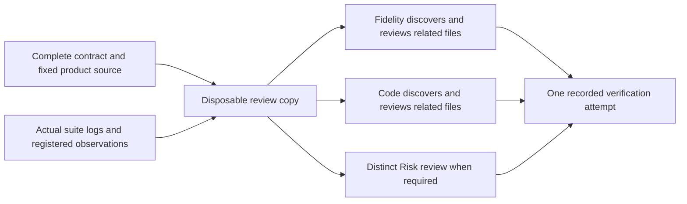

# Autonomous review of a fixed source copy

Status: implementation and repository verification complete; the large-case semantic replay retains an unresolved timeout.
The original diagnosis and size-only reconstruction below are historical evidence.
Successful harness checks and live execution do not imply a successful whole-product verification or receipt.

## Historical incident and verified boundary

The requested session `01a08578-1fb7-70f2-955e-b342f881e2ec` is the delegated Implementor for `vibecoding-class` topic `level-test-audience-results-ranking`.
Its handoff names the `implement` pipeline and preserves the original autonomous invocation; the session itself does not invoke `please` again.
The authoritative attempt is `e6dae1e0-a02e-4da8-89bc-0fea13bdfcf3`, recorded on 2026-09-09 from 10:04:11.958Z to 10:04:27.621Z.
Required checks passed: admin 1,653 ms, build 5,349 ms, and typecheck 787 ms.
Fidelity, Code, and high-risk review all returned `ERROR`, with no semantic result, because the local adapter rejected their input before starting the substantive review.
The exact error is `prompt exceeds codex argv budget (400k chars); reduce gate input`, classified as `judge-invalid-output` with reason `input-too-large`.
Each role records two rejected attempts; these are local rejections, not six completed model reviews.
The runner can execute an `OK` backend preflight before discovering the oversized substantive input.
Images prevent a fallback to a backend without attachments, preserving the evidence boundary.

At the initial investigation, the run remained `active`, with one verification attempt, no active verification lease, no completion, and no receipt.
A later checkpoint commit `2b3bcbd` contains the product changes; this is distinct from successful post-receipt local delivery.
At that investigation, the source fingerprint matched the failed attempt: `3123e8295ecf28d5cd5ebe8ff181961f06631bd197d97434b907fe952ffedee1`.
All 52 entries across its source and evidence manifests matched their recorded file hashes during this investigation.
The read-only investigation changed no product source, run state, approval, budget, or verification result.

## Historical reproduction and measurements

Read-only reconstruction used the installed `cli/dist` renderer, the pinned PRD, recorded review context and logs, and the matching source files.
Calling the real adapter's admission boundary with the reconstructed oversized input twice produced the identical error without launching a model or mutating the run.
Temporary reconstruction artifacts are at `/tmp/review-input-audit-zyM9kP/`; they are diagnostic artifacts, not completion evidence.

| Role | JavaScript string length | UTF-8 bytes |
| --- | ---: | ---: |
| Fidelity | 448,688 | 531,545 |
| Code | 448,838 | 531,695 |
| Risk | 443,803 | 526,660 |

The source catalog contains 1,080 paths and consumes 66,337 characters before its heading.
It is repeated inside the 1,125-entry valid-evidence reference list.
The complete diff is 95,408 characters, current source bodies are 95,738 characters before formatting, and raw additional text evidence totals 58,691 characters.
The incident renderer independently bounded some sections at 120,000 characters but does not bound the assembled envelope.
It also repeats canonical Decisions and quotation sources; those repetitions are smaller and must retain their authority semantics when normalized.

| Fidelity rendering experiment | Characters | Meaning |
| --- | ---: | --- |
| Current | 448,688 | Rejects before review |
| Remove the second catalog-sized reference enumeration | 384,071 | Size-only experiment; catalog remains available |
| Also reference complete current bodies through the existing allowlist | 285,880 | Size-only experiment; no source bytes deleted |

These experiments establish removable presentation cost, not equivalent review quality or successful live execution.
The 400,000-character threshold is a harness guard, not an observed provider context-window rejection or an actual operating-system `E2BIG` result.
The host reports `ARG_MAX=1048576`; the renderer's character count is not an argument-byte measurement.
The CLI observed during diagnosis was 0.153.4 and its help advertised stdin input; the adapter's stdin-hang comment cited 0.144.1.
Neither reliable stdin execution nor a safe replacement argv limit was established in this investigation.

## Approved change in direction

The user asked whether the reviewer could find and inspect the relevant files itself instead of receiving preselected related files and large inline bodies.
After the fixed-source-copy approach was explained, the user authorized implementation and actual verification: "그렇게 그럼 쭉 한번 개선해보고 검증까지 직접 돌려서 상황주고 해보는 것까지 진행해".
This explicitly replaces the old exact-selected-files-only policy; the earlier 2026-09-08 workflow document remains historical rather than being retroactively rewritten.
The first proposal to render the catalog once and fill an inline budget is superseded.
Neither deduplicating the catalog nor raising the prompt limit fulfills the approved direction by itself.

For example, when a save function changes, the reviewer starts there and searches the copied tree for its button caller, API route, and error handling.
The implementor does not predict those paths and register ordinary source context as artifacts.
A missing actual runtime observation still remains unverified; source access cannot manufacture observation evidence.

## Implementation

1. Reuse `captureSourceSnapshot` and the existing disposable evidence workspace.
   Copy the complete content-hashed product source set: Git-tracked files plus nonignored untracked regular files, excluding root `agents/**` bookkeeping and symlinks.
   Git ignore rules already keep ignored runtime secrets, dependencies, and generated output out of this set; a tracked file remains source even if an ignore rule matches it.
   This does not claim universal secret detection or silently redefine the source fingerprint.
   Check copied bytes against the fixed snapshot identity and reject missing or changed inputs rather than silently skipping them.
   Copy registered evidence and images separately with their recorded identity and provenance.
2. Replace large inline envelopes with a compact instruction prompt pointing to four generated files under `agents/review-input/`: `contract.md`, `context.md`, `changes.diff`, and `evidence.md`.
   Preserve the complete sealed PRD, Decisions, intent and authority sources, full change diff including deletions, suite facts and logs, observation provenance, and prior findings.
   Generate these documents inside the review copy; they are derived material, not a new source of state or completion authority.
   Keep images available through capable attachment routes.
   Remove inline source bodies and duplicated repository catalogs instead of moving manual selection work to the implementor.
3. Permit read-only file discovery and content search within the copied tree.
   Every reviewer reads the full contract and chooses relevant source to inspect, including unchanged callers and behavior omitted outside the changed paths.
   Continue auditing reads and searches against the copied boundary.
   No live-worktree or host-file reads, project execution, writes, network access, or repository history are authorized.
   Keep bounded execution and explicit errors; broader discovery does not authorize unlimited or unaudited operations.
4. Preserve the existing semantic and state contract.
   Fidelity and Code run independently on the same fixed inputs without the current peer verdict; high-risk adds its distinct safety question on those inputs.
   Fidelity still accounts for every Bn exactly once in grouped assessments with actual evidence references, and Code records its substantive grounds without duplicate all-Bn accounting.
   Retain the shared lease, immutable historical judgments, current-input checks, prior-finding resolution, correction budget, and honest failed attempts.
   Do not add a review stage, per-Bn proof record, project access knob, or separate completion authority.
5. Keep deterministic admission failures distinct from model output failures.
   If the compact request still cannot be admitted, reject it before a substantive review and avoid retrying identical invalid input as a malformed model answer.
   Preserve actual execution counts and expose the failing boundary without copying source into diagnostic errors.
   A transport change is not a substitute for the fixed-copy exploration design and needs its own measured evidence if introduced.

This follows repository principles 1 and 2 together: preserve every requirement while removing duplicate input and manual source selection.
Under principles 4 and 7, the existing source snapshot replaces preselected-file ceremony and repeated inline catalogs; the copied boundary remains CLI-owned.
Engineering principles 7 and 13 favor extending the existing snapshot, reader, and integrity checks rather than creating a second file-selection or freshness mechanism.

## Acceptance and measurement plan

- Exercise a large unrelated path inventory and Korean text without placing the entire inventory or source bodies into the initial prompt.
- Prove unchanged callers are available without artifact registration and can be discovered through read-only search.
- Assert the complete contract and required evidence bytes remain available, including deleted diff hunks, images, and full suite logs.
- Reject missing or changed copied inputs and preserve source/evidence collisions as explicit errors.
- Verify root bookkeeping, ignored files, symlinks, host paths, the live worktree, repository history, network, writes, and project execution stay outside the permitted boundary.
- Plant realistic omissions, including an unchanged caller or missing integration, and inspect live reviewer findings rather than treating valid assessment JSON as semantic proof.
- Retain lease, immutable history, peer-review isolation, image fallback, freshness, and convergence protections in the existing verification suites.
- Before a commit touching `cli/`, clean generated `cli/dist` only in the owned implementation worktree, then run build, root tests, CLI tests, and CLI e2e in the repository-required order.
- Run the same complete actual case through live independent Fidelity, Code, and Risk review; compare initial input bytes, discovery and read calls, retries, wall time, and semantic coverage, and inspect the transcript.
- Count model preflights separately from substantive reviews and local admission rejections; do not infer model executions from `attempts` alone.

The repository-wide suite requirement overrides engineering principle 12's low-impact testing default for this CLI change.
Unit or fixture success alone does not establish live completion, per repository principle 9.
No unrun acceptance item is a PASS.

## Verification and measurements

The owned implementation checkout is `../sasu.worktrees/review-source-exploration`.
The original frozen input retains source fingerprint `3123e8295ecf28d5cd5ebe8ff181961f06631bd197d97434b907fe952ffedee1`.
The final replay copies every original product and observation file byte-for-byte and rerenders only the four derived entry documents.
It contains 1,080 product files and eight attached images.

| Role | Final initial prompt UTF-8 bytes | Historical UTF-8 bytes |
| --- | ---: | ---: |
| Fidelity | 10,636 | 531,545 |
| Code | 10,570 | 531,695 |
| Risk | 6,437 | 526,660 |

The complete contract remains 20,496 bytes, diff 116,734 bytes, and evidence roster 15,887 bytes in separate files.
Context is 19,254 bytes: exact duplicate canonical intent text is referenced once while the complete text and machine-side quotation authority map remain intact.
Full source, deleted diff hunks, captures and suite logs remain available without manual source artifact registration.
Input preparation records are `/tmp/sasu-review-source-original-verified/{metrics,prepared}.json`.

The regression fixtures include 1,600 unrelated files, 15,000 deleted Korean lines, and a 45,000-line QA capture without clipping their contents.
A deletion-only requirement uses the full diff as its sole actual evidence reference; the contract and evidence roster remain insufficient proof.
Unborn Git repositories render genuinely new files as additions.
An existing non-git or uncommitted baseline without saved historical bytes explicitly lists unavailable modified/deleted paths rather than inventing additions or byte-identical content.

### Final repository checks

Against the same final source, the owned `cli/dist` was cleaned and the required commands ran in order.
Build passed in 0.97 seconds, root tests passed 102/102 in 32.26 seconds, CLI tests passed 469/469 in 22.83 seconds, and end-to-end tests passed 129/129 in 204.88 seconds.
All 700 tests passed with no skips or cancellations; the full ordered check took 260.93 seconds.
The result record and complete logs are `/tmp/sasu-review-source-checks/results.json` and its sibling logs.
TypeScript no-emit checking, the 60-test focused boundary suite, and final read-only backend review also passed.

### Actual access boundary

A native probe reproduced the old command-audit gap: changing the tool workdir and reading the same relative filename accessed an external file, while the emitted command string omitted the workdir.
The new native scoped permissions denied that external read before execution and allowed `rg` and `sed` inside the fixed source copy.
The successful probe is `/var/folders/_c/xjlzc0fd7gg04kcy18q5bd240000gn/T/sasu-boundary-final-69jY4v/{probe.json,trace.jsonl,last.txt}`.
The `:minimal` runtime substrate remains readable, including measured access to `/etc/passwd`; this is not a claim that every host file is denied.
The corresponding restricted file tools also allowed inside reads and denied outside Read/Grep/Glob in `/var/folders/_c/xjlzc0fd7gg04kcy18q5bd240000gn/T/sasu-restricted-probe-sn2rrr66/trace.jsonl`.
These native boundary probes ran on macOS; other operating systems were not exercised.

Exploration retains the aggregate read-output budget in force at approval, 384,000 characters, and the configured call timeout.
That budget is now 512,000 by user decision of 2026-09-11; the constant in `cli/src/judge/backends.ts` is its single source.
The old 29-command limit does not apply to Codex exploration because small discovery reads are not model turns; other modes retain their existing limits.
Safe missing relative paths produce ordinary lookup failures, and only an actual approved read pipeline may supply stdin to a pathless filter.
Literal paths must be quoted, including bracketed Next.js routes, and unsafe shell expansion remains rejected.
The final stream tail is audited even without a newline.

### Planted omissions and visual evidence

Actual independent reviewers found the expected middle omission B17, final omission B30, unchanged-caller integration omission B28, and storage failure B31.
Complete and authorized-assumption controls did not invent blocking product or human-approval findings.
The original complete controls passed before machine sleep; interrupted calls are retained separately and are not counted as successful review.
The awake Codex rerun covered B30, B28, B31, authorized assumptions, and visual evidence: 10 calls, all one attempt, zero retries, 287.89 seconds total.
Its records are `/tmp/review-source-live-codex-remaining{.log,-summary.json}`.
The awake Claude rerun covered B17, B30, B28, B31, and authorized assumptions: 10 calls, all one attempt, zero retries, 369.60 seconds total.
Its records are `/tmp/review-source-live-claude-remaining{.log,.summary.json}`.
Claude read-command counts were unavailable and were not inferred from token counts.
These planted evaluations preceded the final wording, canonical-context deduplication and safe-pipeline refinements; the final whole-case replay below exercises those refinements together.

### Failures retained during development

An overnight whole-suite run was interrupted by recorded clamshell sleeps and produced timing failures; it is not a passing run or a usable latency benchmark.
A subsequent awake suite passed all 129 end-to-end tests before the final context refinement.
That refinement exposed a test helper which still parsed human-source text as a single JSON object; the repaired helper asserts every original quotation source and canonical pointer without changing the authority expectations.
Live exploration also exposed missing-path rejection, an inappropriate command-count ceiling, stdin-filter rejection, and unclear feedback for unquoted bracketed paths.
These were repaired at the reader/prompt boundary without permitting outside access, shell expansion or project execution.
A reviewer exceeded the retained output budget and another supplied narrative text where an exact changed-path reference was required; those attempts remain errors, not semantic verdicts.
A prior original-case Risk replay completed and reported a concrete v1/v2 share-deletion bypass; findings from separate attempts are not combined into a fictitious successful whole attempt.

### Final original-case execution

All three roles used the same original frozen source, observations, final entry documents and configured production profiles, concurrently.
The full replay took 865.74 seconds and did not produce a successful whole-review result.

| Role | Wall time | Substantive attempts | Result |
| --- | ---: | ---: | --- |
| Fidelity | 606.34 s | 1 | ERROR: configured 600-second call timeout |
| Code | 865.68 s | 2 | First read output 390,161 > 384,000 characters; correction attempt then timed out |
| Risk | 496.49 s | 2 | Valid FAIL: concrete share-deletion bypass; 23 commands in the settled attempt |

Risk first attempted the unsupported sed end-of-file script and corrected it on retry.
Its valid finding cites the old public v1 publishing RPC, the v2 migration and shared-result lookup: inserting a v1 row with an existing v2 UUID can revive the same link after deleting only the v2 row, contradicting B22/D-13.
This is a review finding on the frozen historical product, not a new exploit execution or a finding asserted against the amended current tree.
The complete records are /tmp/sasu-review-source-original-verified/fidelity-result.json, code-result.json and risk-result.json.
Timeout records do not expose completed read activity, so unavailable command counts are not reported as zero.
Backend preflights are separate from the substantive attempt counts in the table.

The oversized initial-request failure is removed, discovery and actual semantic review are demonstrated, and mechanical/state/access regressions pass.
Large-case completion and efficiency are not established: two roles still time out and one over-read remains visible.
No timeout, read-output cap, model profile, required review, or product requirement was relaxed to obtain a passing result.
The next performance investigation should attribute time to actual reads, repeated broad searches and model waiting before choosing a change; a smaller entry prompt alone does not establish a faster full review.
There is no justification here for deleting contract content, reusing a peer verdict, accepting the product risk, or claiming a completion receipt.

### Installation contract

Both runtime skill trees were staged locally from the same 49 effective contract files and checked against their canonical transformations.
Every SKILL.md is a real file.
A fresh Codex prompt-input load and a fresh Claude Skill invocation selected the staged implementation skill and sibling paths.
Both local CLI shims reported contract version 0.10.0.
Evidence is `agents/benchmarks/review-source-staging/result.json` and its referenced loading traces.
The implementation commit c80190a was fast-forwarded into the previously clean local main checkout.
The canonical installer then rebuilt the CLI and installed all ten skills for both runtimes.
All 27 Codex and 22 Claude effective contract files matched their canonical transformations, and every installed SKILL.md was a regular file.
A fresh installed Codex prompt-input invocation discovered implement; the four changed built modules matched the tested isolated build byte-for-byte.
The installed command reports contract version 0.10.0 and points to the main checkout.
Installation evidence is /tmp/sasu-review-source-install.json and /tmp/sasu-review-source-installed-prompt.json.
No remote push or product-run verification/finalization was performed.

## Existing product run boundary

While this verification was running, another session amended the product PRD at `2026-09-09T22:56:59.154Z` and changed its source.
The new PRD hash is `ff6502021970bf25ef8872b55b6a1a10a9c54962c4925021bfcfd191fa5fd4a3`; the subsequently observed source fingerprint is `49a04c06b3a6ae80386ca951b5fbb32064f47967544ce9356650e5f55bbbe3ba`.
A diagnostic replay of that newer tree is supplemental evidence and cannot represent the unchanged original case or a fresh product receipt.
The final regression therefore uses the preserved original frozen copy.
No original product source, run state, acceptance authority, correction budget, or verification history was changed by this work.
Its recorded suite logs are historical evidence, not newly executed product checks.
The active owner must run current `verify` against the amended contract before completion; this harness regression does not finalize or deliver that product run.
