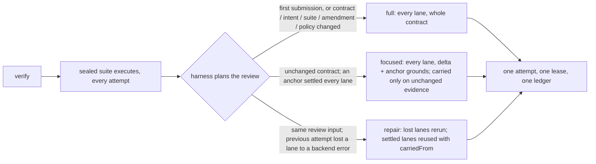

# Impact-scoped re-review and same-input lane repair

Status: implemented on branch `incremental-review`; deterministic regression and live before/after measurement recorded below.
Issue: [yansfil/sasu#3](https://github.com/yansfil/sasu/issues/3).

## Approved change in direction

The user approved replacing whole re-review on every correction with impact-based re-review, whole review where the impact is broad, and preservation of a settled independent review when only its peer failed on the same input ("2번 작업도 마찬가지로 issue로 뽑고 sasu쪽에 pane 만들어 fable5.1로 ㅇㅇ 그래서 그 이슈진행하게 해").
Whole-contract tracking, independence, fixed inputs, immutable settled judgments, the lease, bounded convergence and the error/defect distinction are unchanged.
No override, project knob, suite cache or test-skipping switch is added.

## Measured motivation

The herdr `guarded-agent-prompt` run (`agents/runs/guarded-agent-prompt/state.json`, 2,478 product files, 10 requirements) recorded seven attempts.
Attempt `75ed15ab` settled Fidelity as a valid FAIL in 451 s (28 reads, 485,953 chars) and lost Code to a Claude turn cap after 763 s; the attempt was ERROR and both results were discarded for the next round.
Attempt `289fc0fc`, after a two-file fix, reviewed everything again: 513 s, Fidelity 63 reads and 228,754 chars, Code 31 reads and 425,684 chars.
Its round context said "changed paths since the prior attempt: none" because the prior attempt had been interrupted before review; the two changed files were not named.

## The three rounds

Example.
A run with B1..B3 passes its first verify (full).
The implementor changes `implementation.txt` and verifies again: the round is focused, anchored on attempt 1; Fidelity is shown its own attempt-1 grounds, marked "cites changed evidence; re-review" for the group citing `implementation.txt` and "cited evidence unchanged; may be carried" for the group citing `helper.txt`; it re-reviews B3 and carries B1 and B2; Code re-reviews the change and its callers.
Status says `Review scope: focused (reference attempt 1)` and `Requirement grounds: 1 reviewed in this attempt, 2 carried from <attempt 1>`.
If Code had failed with a backend error on that round, the next verify on the unchanged input would be a repair: the suite runs again, only Code is invoked, Fidelity's settled record is reused under `carriedFrom`, and Code sees the findings ledger exactly as Fidelity saw it.

## Implementation

`cli/src/implement/review-scope.ts` plans each attempt from the record: `planReview` returns the mode, the reason, the reference attempt, the ledger the reviewers are shown and the round context.
The anchor of a focused round is the last attempt that settled every required lane without error; the delta and every carried ground are checked against it, so changes across intervening partial attempts count as changed.
A repair requires the previous attempt to have errored inside review with at least one settled lane, an equal `inputFingerprint`, an equal review policy, no accepted domain command since, and pinned repair records; that decision is final.
A second gate that digested the prepared review context as `identity` and compared it with the reference attempt's was retired on 2026-09-15: on a repair the context is built from the reference's pinned snapshot and scope, and the rest follows from the fingerprint and policy already compared, so the digest could only agree with itself.
Attempts pin `contractFingerprint` (the input identity without source and evidence) and `reviewPolicySha256` (CLI contract version, the effective judge routing after any `SASU_JUDGE_BACKEND` pin, review profile); the review context pins `scope` and `ledgerSnapshot`; lanes reused on a repair carry `carriedFrom`; the attempt records `reviewScope`.
`validateImplementationReviewResult` accepts `basis: carried` only in a focused round, only for a satisfied ground the same role settled at the anchor, on evidence cited there and unchanged since, never for a requirement an open blocking finding names, and never in a round the reviewer declared widened.
`reconcileAttemptLedger` rebuilds a repair round's ledger from the pinned snapshot with the reused role first, so its finding ids survive and nothing is entered twice.
The prompt adds `REVIEW SCOPE` instructions and the role's own anchor grounds; the peer's grounds are never shown.
Status, the verify result and the receipt report the mode, the reason and `requirementGrounds`.
Records made before this change have no scope fields and are read as full reviews; they cannot anchor a focused round or a repair, so an active run continues with full rounds until it produces a settled attempt under the new CLI.

What leaves: the whole re-review of an unchanged contract on every correction, and the discard of a valid settled lane when its peer fails.
What is added: one planning module, six optional record fields, one optional assessment field and one optional result field; no command, flag or configuration key.

## Acceptance

- Deterministic (`cli/test/e2e/implement-incremental-review.test.mjs`, unit suites for review-scope, review-contract, convergence, store): first round full; focused round shows anchor grounds and records carried grounds and requirement grounds; carried on changed evidence, reopened requirement or outside a focused round refused; amended contract widens to full; repair reruns only the lost lane, reuses the peer byte for byte, hides the peer's finding from the rerun role, keeps finding ids, executes the suite again, counts one correction round; a moved input refuses repair and both roles run.
- Live (`docs/audits/2026-09-14-incremental-review/`): the same fixture, contract and routine judge profile through the main build and this branch, one round sequence each.

## Live measurement

Protocol, raw records and the full tables: [`docs/audits/2026-09-14-incremental-review/`](../audits/2026-09-14-incremental-review/results.md).
Two builds (main `89756b5` and this branch) ran the same seven-round fixture concurrently with real judges on 2026-09-14.

- Repair round (one lane killed, then the same input again): the candidate reran only the lost Code lane, 1 judge call instead of 2, 90 s instead of 119 s wall, 10,730 instead of 24,573 metered read chars, 189,696 instead of 329,455 input tokens.
  The reused Fidelity record is byte-equal to its origin, the suite ran again, finding ids were kept, and the fresh lane was built from the pinned ledger snapshot.
- Focused rounds (R2 to R4): the harness planned `focused` every time and each role declared a traced scope, but no role carried a ground because every requirement on this fixture reaches the changed file through one call path.
  Cost did not drop there (492 s versus 460 s wall over five verifies, more input tokens for the anchor grounds document); the cost side of the focused round is unproven until a fixture where most requirements do not reach the change is measured.
- Detection: the planted shared-helper defect (R3) was found by both roles on both builds and resolved by both in R3b.
  The contradicting-evidence round (R4) was missed by both builds alike.
  No round detected less on the candidate than on the baseline.
