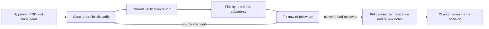

# Stateless verification with native agent review

Status: approved by the user on 2026-09-15.

## Decision

Sasu will stop treating an accumulated receipt and judge lifecycle as delivery authority.
Verification will be recalculated from the current approved PRD, Git base and head, required suite results, and registered evidence.
Sasu code will block only on deterministic facts it can reproduce.
Codex and Claude will run their own native review subagents through the installed workflow skill, outside the CLI.
Agent review will be visible advice for the pull request, while GitHub CI and human review remain the delivery decision.

The user additionally approved fixing concrete bugs discovered during review when they belong to the current behavior and change surface.
Review findings outside that boundary will be recorded as follow-up improvements in the pull request instead of expanding the implementation silently.

## One flow



Example.
A feature branch passes its required tests and records a current screenshot.
The Code reviewer finds a missing error branch in a file changed for the feature, so the implementor fixes it and reruns deterministic verification against the new head.
The reviewer also suggests reorganizing an adjacent module, which is useful but not required for the approved behavior, so the pull request lists it under Follow-up improvements.
If a reviewer times out, the report says `REVIEW_UNAVAILABLE`; it never changes a successful test result into an implementation failure.

## Responsibilities

### Sasu CLI

The CLI owns only reproducible facts:

- pin the approved PRD identity and Git base/head;
- run every required repository suite and record its real exit code;
- reject source or registered evidence that changes during the run;
- validate that registered evidence exists and still has its pinned bytes;
- write a fresh machine-readable and Markdown verification report for the current head;
- expose every failed or unrun check directly to the caller.

The CLI does not start a model, count model turns, parse reviewer JSON, retry a reviewer, reconcile finding identifiers, or combine reviewer verdicts into delivery eligibility.

### Runtime workflow skill

The installed `implement` workflow owns native agent review:

- Codex uses Codex subagents and Claude Code uses Claude Code subagents;
- Fidelity and Code reviews run concurrently after deterministic verification succeeds;
- high-risk work adds an independent Security review;
- Sasu adds no reviewer turn limit beyond the runtime's own limits;
- the parent agent can inspect progress, tool use, errors, and the final response;
- one review is requested per current head, with no automatic loop until PASS;
- a runtime failure is reported as `REVIEW_UNAVAILABLE` with its visible cause;
- reviewer output is plain Markdown and does not need a strict machine schema.

The review prompt asks for two groups:

1. **Fix now** contains concrete defects in the approved behavior, touched flow, error path, or necessary regression coverage.
2. **Follow-up improvements** contains useful cleanup, refactoring, polish, or product expansion that is not needed for the current contract.

The implementor fixes Fix now findings that remain within the approved scope, reruns deterministic verification after source changes, and summarizes the final disposition in the pull request.
A finding that changes product behavior, expands the approved contract, changes data or authorization policy, or requires destructive work still needs the existing human decision path.

### GitHub and people

The pull request is the review surface.
It shows the current verification report, screenshots or other material evidence, Fix now dispositions, unresolved concerns, and Follow-up improvements.
GitHub Actions reruns the repository checks from the pushed head.
Human reviewers decide whether an advisory finding needs another fix and whether the change may merge.
Authentication, payment, destructive data, security, and architecture changes require an independent specialist review and explicit human approval through repository review rules.

## Current report

The derived report is a snapshot, not a completion token.
It is keyed by the approved PRD hash, base SHA, head SHA, source fingerprint, suite configuration, evidence hashes, and generation time.
Any relevant input change makes it stale and the next verification replaces it with a report for the new input.
No older PASS is copied forward by assertion.

The report contains:

```text
PRD SHA
base SHA
head SHA
source fingerprint
required command, cwd, exit code, duration and log path
registered evidence path, hash and observation provenance
unrun or unavailable checks
generation time
```

Agent review notes remain separate Markdown authored by the runtime agents.
The report may link them for the pull request but does not parse them or derive a PASS from them.

## What leaves

The cutover deletes the retired behavior in the same change:

- completion receipt as delivery authority;
- `finalize` and correction-budget closure;
- Fidelity, Code and Risk judge execution inside `sasu implement verify`;
- reviewer turn caps owned by Sasu;
- strict reviewer JSON and grouped-assessment validation;
- tracked finding identifiers and prior-disposition reconciliation;
- full, focused and repair review planning;
- reviewer failures changing the implementation status to blocked;
- ship requiring a semantic-review PASS receipt.

Run state may continue to hold implementation ownership, worktree identity, approved inputs, required suites, evidence registrations, event history, and the latest deterministic report identity.
It is bookkeeping for the current run and never a second semantic completion authority.

## Delivery behavior

`ship` validates the current deterministic report, the Git head, base freshness, staging boundary, CI, mergeability, and explicit merge approval.
It includes agent-authored review notes in the pull request when present but never requires a reviewer process to have succeeded for an ordinary change.
A reviewer failure stays visible as unavailable.
High-risk review requirements belong to GitHub review policy and human approval, not to a mutable local receipt.

## Acceptance

- A required suite failure blocks verification with its real command and exit code.
- A reviewer timeout after successful suites does not change the deterministic result and appears as `REVIEW_UNAVAILABLE` in the pull request material.
- A source edit after verification makes the report stale and prevents delivery until deterministic verification runs again.
- A concrete in-scope bug found by review can be fixed and included in the same pull request after verification reruns on the new head.
- An out-of-scope suggestion appears under Follow-up improvements without blocking delivery.
- Codex and Claude installed skills both instruct their native subagent mechanism and do not route review through the Sasu judge CLI.
- The CLI help, implementation skill, shipping skill, benchmark tooling, tests, and generated reports contain no active receipt or finalize workflow.
- Retired state and receipt schemas fail explicitly with the last commit that supported them; no compatibility read path remains.

## Principles

This applies repository principles 2 and 7 by making deterministic proof smaller than the implementation and keeping semantic judgment with visible agents and people.
It applies repository principles 4 and 13 by deleting stages that do not uniquely catch a failure and removing a non-convergent reviewer loop.
It applies repository principle 10 by distinguishing failed checks, unavailable reviews, and later suggestions without turning one into another.
It applies engineering principles 2, 4, 10, and 13 by choosing one reproducible verification path, surfacing every failure to the caller, and fixing the hidden-background-review failure class.
